% Accesibilidad Web
% Adolfo Sanz De Diego
% Septiembre 2014

# El autor

## Adolfo Sanz De Diego

- **Antiguo programador web JEE (6 años)**

- Hoy en día:

    - **Profesor de FP (6 años)**:
        - Hardware, Sistemas Operativos
        - Redes, Programación

    - **Formador Freelance (3 años)**:
        - Java, Android
        - JavaScript, jQuery
        - JSF, Spring, Hibernate
        - Groovy & Grails

## Algunos proyectos

- Fundador y/o creador:

    - **Hackathon Lovers**: <http://hackathonlovers.com>
    - **Tweets Sentiment**: <http://tweetssentiment.com>
    - **MarkdownSlides**: <https://github.com/asanzdiego/markdownslides>

- Co-fundador y/o co-creador:

    - **PeliTweets**: <http://pelitweets.com>
    - **Password Manager Generator**: <http://pasmangen.github.io>

## ¿Donde encontrarme?

- Mi nick: **asanzdiego**

    - AboutMe:  <http://about.me/asanzdiego>
    - GitHub:   <http://github.com/asanzdiego>
    - Twitter:  <http://twitter.com/asanzdiego>
    - Blog:     <http://asanzdiego.blogspot.com.es>
    - LinkedIn: <http://www.linkedin.com/in/asanzdiego>
    - Google+:  <http://plus.google.com/+AdolfoSanzDeDiego>

# Introducción

## Objetivos

- La accesibilidad web **no se centra sólo en las personas con discapacidad**, en realidad tiene como objetivo lograr que las páginas web sean utilizables por el máximo número de personas, **independientemente de sus conocimientos o capacidades personales e independientemente de las características técnicas del equipo** utilizado para acceder a la Web.

## Oportunidades

- Ofrece **oportunidades sin precedentes** para los discapacitados:
    - Los ciegos pueden leer periódicos gracias a los lectores de pantallas.
    - Los sordos pueden ver vídeos subtitulados.
    - Las personas con discapacidad motora pueden utilizar programas de "eye-tracking"

## Dificultades

- A pesar de ello, **todavía quedan cosas por hacer**:
    - Hay sitios web que sólo se pueden usar con el ratón.
    - Muchos vídeos no están subtitulados para sordos.
    - Hay interfaces en donde no hay substituto a la interacción con imágenes.

## Destinatarios

- La mayoría de los estudios estiman que un **20% de la población tiene algún tipo de discapacidad**, no todas tienen discapacidades que dificultan su acceso a Internet, pero sigue siendo una parte importante de la población.

- Cada discapacidad requiere de ciertos tipos de adaptaciones, que la mayoría de las veces, **beneficiarán a casi todos, no sólo a las personas con discapacidad**.

## Desarrolladores

- La mayoría de los errores de accesibilidad web son **por falta de conocimientos del desarrollador**.

## Lenguaje correcto

- Persona con discapacidad
- Persona con discapacidad motriz
- Persona con discapacidad auditiva
- Persona con discapacidad visual
- Persona con discapacidad intelectual
- Persona con discapacidad psicosocial

## Lenguaje incorrecto

- Discapacitado, inválido, disminuido
- Minusválido, incapaz, impedido
- Sordomudo, sordito (todos los diminutivos)
- Invidente, cieguito (todos los diminutivos)
- Retrasado mental, mongol, tonto o tarado, deficiente
- Loco, loquito, demente

## W3C

- El W3C es un grupo internacional e independiente que define los **protocolos y estándares para la web**, como HTML, CSS, etc.

## WAI

- Una de las principales iniciativas del W3C es la **WAI (Web Accessibility Initiative)** que se encarga del desarrollo de normas de accesibilidad.

## WCAG

- Las **WCAG (Web Content Accessibility Guidelines)** o Pautas de Accesibilidad al Contenido en la Web son lasprincipales normas de accesibilidad web.

### WCAG 1.0

- Finalizadas en **1999**, fueron un avance importante.

- Proporcionaban **14 directrices** y numerosos puntos de control.

- Proporcionaban tres prioridades:
    - **Nivel A** requisitos básico,
    - **Nivel AA** mejor accesibilidad y la eliminación de importantes barreras,
    - **Nivel AAA** proporcionaba mejoras a la accesibilidad.

### WCAG 2.0

- Se fundamentan en WCAG 1.0, pero introducen algunos cambios significativos.

- Las pautas están **centradas en principios más que en técnicas**, para que sigan siendo relevantes incluso cuando la tecnología cambie.

- Sitúa únicamente 4 principios en el nivel superior, las 4 directrices POUR (Servir).

# Directrices POUR

## Perceptible (I)

- Disponible para los sentidos (visión y audición principalmente), bien a través del navegador o por medio de ayudas técnicas (por ejemplo, **lectores de pantalla, ampliadores de pantalla**, etc.)

## Perceptible (II)

- Directriz 1.1: **Texto alternativo**: Proporciona texto alternativo para el contenido que no sea textual, así podrá ser transformado en otros formatos que la gente necesite, como caracteres grandes, lenguaje braille (braile no es correcto), lenguaje oral, símbolos o lenguaje más simple.

- Directriz 1.2: **Contenido multimedia dependiente del tiempo**: Proporcione alternativas sincronizadas para contenidos multimedia sincronizados dependientes del tiempo.

## Perceptible (III)

- Directriz 1.3: **Adaptable**: Crear contenido que pueda ser presentado de diferentes formas sin perder ni información ni estructura.

- Directriz 1.4: **Distinguible**: Facilitar a los usuarios ver y escuchar el contenido incluyendo la distinción entre lo más y menos importante.

## Operable (I)

- Los usuarios pueden interactuar con todos los controles y elementos interactivos usando **el ratón, un teclado o un dispositivo de ayuda**.

## Operable (II)

- Directriz 2.1: **Teclado accesible**: Poder controlar todas las funciones desde el teclado.

- Directriz 2.2: **Tiempo suficiente**: Proporciona tiempo suficiente a los usuarios para leer y utilizar el contenido.

## Operable (III)

- Directriz 2.3: **Ataques epilépticos**: No diseñar contenido que pueda causar ataques epilépticos.
- Directriz 2.4: **Navegación**: Proporciona formas para ayudar a los usuarios a navegar, a buscar contenido y a determinar donde están estos.

## Comprensible (I)

- El contenido es claro y se **limita la confusión y la ambigüedad**.

## Comprensible (II)

- Directriz 3.1: **Legible**: Hacer contenido de texto legible y comprensible.

- Directriz 3.2: **Previsible**: Hacer la apariencia y la forma de utilizar las páginas web previsibles.

- Directriz 3.3: **Asistencia a la entrada de datos**: Ofrecer ayuda a los usuarios para evitar y corregir errores.

## Robusto (I)

- Una **amplia gama de dispositivos y tecnologías** puede acceder al contenido.

## Robusto (II)

- Directriz 4.1: **Compatible**: Maximiza la compatibilidad con los agentes de usuario actuales y futuros, incluyendo tecnologías de asistencia.

# Mitos

## Las páginas web accesibles son feas

- **FALSO**. De hecho la mayoría de los principios de accesibilidad web no afectan al acabado final (look and feel) de un sitio web.

## Las personas con discapacidad no utilizan la Web

- **FALSO**. Más bien todo lo contrario, ya que las nuevas tecnologías e Internet ha permitido a un gran número de personas con discapacidad llevar una vida autónoma e independiente.

## Las páginas web con sólo texto son accesibles

- **FALSO**. Las páginas web que sólo contienen texto pueden ser difíciles de entender por personas con discapacidad cognitiva o con dificultades con el lenguaje como las personas sordomudas.

## La accesibilidad es cara y costosa

- **FALSO**. Evidentemente, el proceso de aprendizaje y la posterior adaptación a los sitios web ya existentes suponen un coste, pero igual que aprender una nueva tecnología (por ejemplo, AJAX) y adaptar los sitios web a la nueva tecnología.

## La accesibilidad es sólo para ciegos

- **FALSO**. Existen usuarios con diferentes tipos de discapacidad que pueden experimentar distintos problemas de acceso y uso del contenido de las páginas web.

## La accesibilidad es sólo para las personas con discapacidad

- **FALSO**. Aunque las personas con discapacidad pueden ser los usuarios que más se beneficien al aplicar la accesibilidad web, en realidad se beneficia todo el mundo, ya que también ayuda a cualquier usuario que se encuentre en circunstancias especiales como puede ser entornos con baja iluminación, ambientes ruidosos, acceso a Internet con conexiones y equipos con capacidades limitadas, etc.

# Beneficios

## Mejora el posicionamiento en Buscadores

- El cumplimiento de las pautas, tanto en código como en contenidos semánticos (por ejemplo, vínculos con sentido) **permite a los buscadores una mejor identificación de los contenidos**, y en consecuencia, mayores posibilidades de posicionamiento en los motores de búsqueda.

## Se incrementa el número de potenciales visitantes

- La **eliminación de barreras de entrada** a una web permite superar las limitaciones del usuario, captando nuevos usuarios.

## Aumenta la usabilidad de la página

- Si se consigue una página accesible, se aumenta considerablemente la usabilidad de la misma, **no sólo a los discapacitados sino a todos**.

## Se cumplen los estándares web

- Esto implica que nuestra página web será **visionada correctamente desde cualquier navegador**.

## Reduce el tiempo de carga de las páginas web

- Al **separar el contenido de la presentación mediante CSS** se logra reducir el tamaño de las páginas web.

## Reducimos el coste de mantenimiento

- Separar el diseño y contenido, normalmente **genera menos código más limpio**, lo que favorecerá futuras modificaciones de la web.

## Demuestra responsabilidad social

- La eliminación de barreras que dificulten el acceso a nuestra web demuestra una preocupación y atención hacia todos los clientes, lo que ayuda a **mejorar la imagen de nuestra empresa**.

## Cumplir la Ley

- Es un **derecho ciudadano la participación y la no discriminación** por razón de discapacidad.

# Problemas discapacidad

## Visual

- Imágenes o elementos multimedia **sin texto alternativo**
- Tamaño del **texto muy reducido**
- Información basada **exclusivamente en el color**
- Combinaciones de **colores con poco contraste**

## Auditiva

- Ausencia de **transcripciones** del audio
- Ausencia de **subtítulos** en vídeos
- Textos **largos y complejos**
- Ausencia de **imágenes que complementen** la información textual

## Física

- Interfaces de usuario que sólo se pueden **utilizar con ratón**
- Enlaces y controles de **formulario muy pequeños**
- Interfaces de usuario que requieren un **control muy preciso**
- Interfaces de usuario con **tiempos de respuesta** por parte del usuario muy pequeños

## Cognitiva y neurológica

- Textos **largos y complejos**
- Ausencia de **imágenes que complementen** la información textual
- Ausencia de un **mapa del sitio web**
- Ausencia de **descripciones y ayudas** para interpretar los controles de un formulario
- **Inconsistencias** entre distintas páginas de un mismo sitio web

## Relacionadas con el envejecimiento

- Normalmente, problemas relacionados con:
    - la discapacidad **visual**,
    - la discapacidad **auditiva** y
    - la discapacidad **física**. 

## Tecnológica

- **Sistemas operativos** antiguos
- **Navegadores** alternativos
- **Ancho de banda** de comunicación por Internet bajo
- Ausencia de un **plugin** para reproducir ciertos contenidos
- Dispositivo de visualización de **pequeño tamaño**.

# ¿Cómo navegan los usuarios?

## Con ceguera total o visión muy reducida

- Utilizan **lectores de pantalla** que les permiten la utilización del sistema operativo y de las distintas aplicaciones de un ordenador mediante el empleo de un sintetizador de voz que "lee y explica" lo que se visualiza en la pantalla del ordenador.

## Con deficiencia visual o visión parcial

- Recurren al **aumento del tamaño del texto**, emplean combinaciones de colores con un **alto contraste** o emplean **magnificadores de pantalla** que les permiten visualizar la pantalla con un considerable aumento en su tamaño.

## Con ceguera al color (daltonismo)

- No suelen emplear **ningún tipo de tecnología de apoyo**.

## Con sordera total o deficiencia auditiva

- No suelen emplear **ningún tipo de tecnología de apoyo**.

## Con discapacidad física

- Emplean diferentes tipos de dispositivos adaptados según el grado de movilidad que conserven: **teclados especiales, conmutadores, sistemas de reconocimiento de voz, sistemas de reconocimiento facial, etc**.

## Con discapacidad cognitiva

- Suelen emplear **navegadores accesibles** que simplifican la navegación. 

# Hardware

## Apuntador

- Casco con una **varilla metálica**.

- Indicado para personas pérdida de movilidad en las extremidades superiores, pero con un buen control del movimiento de la cabeza.

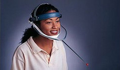

## Conmutadores

- Activados por **presión**. En la imagen se aprecia para la boca, pero los hay para el puño.

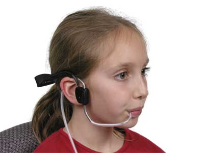

## Teclados

- Los hay con **teclas grandes**, con protectores para **impedir la pulsación errónea**, con **reguladores de repetición**, incluso diseñados **para una sola mano**.

## Webcams

- Permiten reconocer los **movimientos de la cara**.

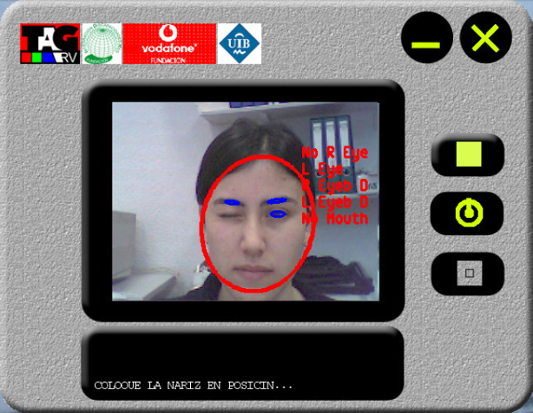

## Líneas braille

- Permiten **leer** el lenguaje braille.

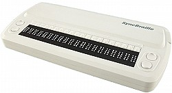

## Teclados braille

- Permiten **escribir** el lenguaje braille.

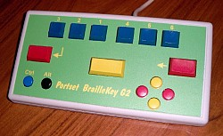

## Línea + teclado

- Permiten **leer y escribir** el lenguaje braille.

## PDAs braille

- Permiten **escuchar y escribir**, pues son teclados braille con un lector de pantallas (en vez de la línea braille)

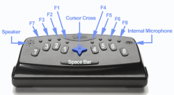

# Software

## Lectores de pantalla (I)

- **NVDA**: Gratuito y Software Libre. Para Windows.
    - <http://www.nvda-project.org>

- **ORCA**: Gratuito y Software Libre. Para Linux.
    - <https://wiki.gnome.org/action/show/Projects/Orca>

- **VoiceOver**: Viene en los sistemas de iOS y OSx.
    - <https://www.apple.com/es/accessibility/ios/voiceover>
    - <https://www.apple.com/es/accessibility/osx/voiceover>

## Lectores de pantalla (II)

- Se debería **probar la web** con al menos estos 3 lectores de pantalla.

- El problema es que **hay que aprender a usar** los lectores de pantalla, y además **los videntes no los usan de la misma forma** que los no videntes.

- Aún así es una **buena práctica**.

## Magnificadores de pantalla

- **Virtual Magnifying Glass**: Gratuito y Software Libre. Multiplataforma (Windows, Linux, FreeBSD and OS X)
    - <http://magnifier.sourceforge.net>

## Teclados virtuales

- Casi todos los sistemas operativos vienen hoy en día equipados con un software de este tipo.

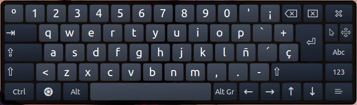

# Desafíos y soluciones

## Ceguera (I)

- **Imágenes, fotos, gráficos inservibles**
    - Proveer de descripciones de texto en el atributo alt, si fuesen necesarias explicaciones más largas (tanto en la misma página como con un enlace externo).

## Ceguera (II)

- **Algunos usuarios a veces escuchan la web**
    - Crea enlaces que permitan a los usuarios saltar los menús de navegación, listas de items, arte ASCII y otros elementos que puedan dificultar o hacer tediosa la escucha.

## Ceguera (III)

- **Los usuarios a menudo saltan de enlace a enlace con el tabulador**
    - Asegúrate que los enlaces tienen sentido ("clickea/pulsa aquí" es problemático).

## Ceguera (IV)

- **Los usuarios generalmente no utilizan el ratón**
    - No escribas scripts que necesiten el uso del ratón. Provee de de alternativas por teclado (por ejemplo, utiliza onFocus en vez de onMouseover).

## Ceguera (V)

- **Puede ser difícil para los usuarios saber donde están cuando escuchan el contenido de una tabla**
    - Provee de encabezados en las columnas y las filas para los datos de la tabla (\<th\>).
    - Evite, si es posible, filas o columnas expandidas.

## Ceguera (VI)

- **Los gráficos y las tablas de datos complejas que son interpretados visualmente son inservibles**
    - Realice resúmenes y/o descripciones de texto, preferiblemente en la misma página, o enlace con otra página como alternativa.

## Ceguera (VII)

- **Los marcos no pueden ser vistos. Debemos acceder a ellos por separado, por lo que conlleva desorientación**
    - No uses marcos a no ser que sea inevitable. Si lo usas, utilice títulos en el marco para reflejar su proposito. (Por ejemplo, "marco de navegación", "contenido principal").

## Ceguera (VIII)

- **Los colores son inútiles**
    - No utilices el color para representar un significado.

## Ceguera (IX)

- **Los usuarios esperan que los links les lleven a algún sitio**
    - No escribas scripts en links que no tengan un destino verdadero asociado (por ejemplo href="javascript: function(this)").

## Ceguera (X)

- **Los lectores de pantalla leen el contenido en el orden que aparece en el código**
    - Asegúrate que los CSS complejos o los diseños maquetados con tablas se leen correctamente, tanto visualmente como en el código.

## Ceguera (XI)

- **Hay quien no puede ver videos**
    - Disponga de descripciones auditivas de los hechos del video que no puedan ser interpretados por el audio de este. (por ejemplo que un narrador describa las acciones en los videos, en los que no haya diálogo).

## Ceguera cromática

- **Colores con un contraste similar a menudo son indistinguibles**
    - Asegúrate que tienen un contraste suficiente.
    - No utilices solo el color para representar un significado.

## Problemas visuales (I)

- **A menudo los usuarios utilizan ampliadores de pantalla**
    - Para reducir el total del desplazamiento horizontal, utiliza unidades relativas en vez de absolutas (por ejemplo, usa porcentajes para el ancho de las tablas, en vez de píxeles).

## Problemas visuales (II)

- **El texto en gráficos no se amplía sin un software especial, y se ve pixelado cuando se amplía**
    - Límita o elimina el texto dentro de gráficos.
    - Usa anti-aliasing para conseguir un texto claro y legible.

## Sordera

- **El audio es inútil**
    - Provee de transcripciones para el audio.
    - Provee de subtítulos sincronizados para los vídeos.

## Discapacidades motoras (I)

- **Los usuarios puede que no sean capaces de utilizar el ratón**
    - Asegúrate que todas las funciones están disponibles desde el teclado (intenta que con el tabulador salte de enlace a enlace).
    - Asegúrate que el orden es lógico.

## Discapacidades motoras (II)

- **Los usuarios que utilizan tecnologías de soplado y aspirado, o similares pueden fatigarse**
    - Proporciona un método para saltar listas largas o enlaces redundantes u otros contenidos tediosos.

## Discapacidades motoras (III)

- **Los usuarios utilizan software activado por voz**
    - El software de reconocimiento de voz generalmente no puede replicar el movimiento del ratón de una manera tan efectiva como con el uso del teclado, así que asegúrate que todas las funciones están disponibles desde el teclado.

## Discapacidades cognitivas (I)

- **Los usuarios pueden confundirse con diseños confusos o sistemas de navegación inconsistentes**
    - Simplifica el diseño tanto como sea posible.
    - Mantén los sistemas de navegación tan consistentes como puedas.

## Discapacidades cognitivas (II)

- **Los usuarios pueden tener dificultades de concentración o comprensión con párrafos largos**
    - Donde sea apropiado, agrupa la información debajo de encabezados lógicos.
    - Organiza la información en "trozos" manejables.

## Discapacidades cognitivas (III)

- **Un solo método puede no ser suficiente**
    - Donde sea necesario, agrega ilustraciones u otro medio al texto, y vice versa.

# Principios claves

## Proporciona un texto alternativo adecuado

- El texto alternativo proporciona una alternativa textual **a los contenidos que no son texto** en las páginas web.

- Es especialmente útil para las personas que son ciegas y dependen de un **lector de pantalla** para acceder al contenido de un sitio web. 

## Proporciona encabezados para las tablas de datos

- Las tablas que se utilizan para organizar datos tabulados deben tener encabezados adecuados (el **elemento \<th\>**).

- Las celdas de datos deben estar asociadas con sus cabeceras adecuadas, lo que hace que sea **más fácil para los usuarios de lectores de pantalla navegar y entender las tablas** de datos. 

## Garantiza que los usuarios pueden completar y enviar todos los formularios

- Asegúrate de que cada elemento de un formulario tiene asociada una **etiqueta \<label\>**.

- Además, asegúrate de que puede enviar el formulario y **recuperarse de cualquier error**.

## Asegura que los enlaces tengan sentido fuera de contexto

- Cada enlace debe tener sentido si el texto del enlace es **leído de forma aislada**.

- Los usuarios de lectores de pantalla pueden **optar por leer sólo los enlaces** de una página web.

- Ciertas frases, como **"haga clic aquí" y "más", deben ser evitadas**.

## Subtitula y/o proporciona transcripciones

- Los vídeos deben tener subtítulos y el audio transcripción.

- Esto es especialmente **útil para personas con discapacidad auditiva, pero no sólo para a ellas**, pues a cualquier persona le puede interesar tener los subtítulos de un vídeo o la transcripción de un audio, como por ejemplo para poder traducirlo a otro idioma.

## Garantiza la accesibilidad del contenido que no sea HTML

- Los documentos PDF y otros contenidos que no son HTML deben ser lo más accesible posible.

- Si no puedes hacerlo accesible, **considera el uso de HTML en su lugar** o, al menos, ofrece una alternativa accesible.

## Permite a los usuarios saltar los elementos repetitivos

- Proporciona un método (por ejemplo un enlace **"Saltar al contenido"** en la parte superior de la página) que permita saltarse la navegación u otros elementos que se repiten en cada página.

- Suele ser molesto **cuando se navega con un lector de pantalla que cada vez que se recarga una página vuelve a repetir de nuevo la cabecera** que suele ser idéntica.

## No confíes únicamente en el color para transmitir el significado

- El uso del color puede mejorar la comprensión, pero no uses sólo el color para transmitir información.

- Esa información puede no estar disponible para una **persona que es daltónica** y no estará disponible para **usuarios de lectores de pantalla**. 

## Asegúrate de que el contenido está claramente escrito y es fácil de leer

- Escribe con claridad, utiliza tipos de letras evidentes, y **emplea los encabezados y las listas adecuadamente**. 

## Haz accesible el Javascript

- Asegúrate de que los controladores de **eventos de JavaScript** son independientes del dispositivo (por ejemplo, que no requieren el uso de un ratón).

## Diseña según las normas

- El **HTML válido** y las páginas accesibles son más robustas y proporcionan un mejor posicionamiento en los motores de búsqueda.

- El Cascading Style Sheets (**CSS**) permite separar el contenido de la presentación.

# Imágenes y animaciones

## Use el atributo alt

- Para describir la función de cada elemento visual (**IMG, AREA, APPLET e INPUT**).

## Auda a los usuarios

- El **texto alternativo** ayuda a los usuarios:
    - que no tengan terminales gráficas, 
    - cuyos navegadores no soporten formularios,
    - con discapacidades visuales,
    - que utilicen sintetizadores de voz,
    - que hayan configurado sus agentes de usuario para no mostrar imágenes, etc.

## No especificar texto alternativo (I)

- **cuando las imágenes sólo sirven para dar formato a una página**, por ejemplo, alt="bola roja" para una imagen que añade una bola roja para decorar un título o un párrafo; en tales casos, el texto alternativo debería ser la cadena vacía ("").

## No especificar texto alternativo (II)

- **cuando el texto carezca de significado** (p.ej., "relleno quequeda bonito"), pues esto no solamente frustrará a los usuarios, sino que ralentizará a los agentes de usuario que deban convertir texto a salida por voz o Braille.

## Ejemplo de página con imágenes

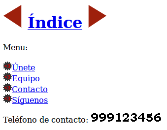

## Mal uso de alt (I)

- Mal uso de alt cuando **describe imagen en vez de su función**

~~~

<a href="indice.html">Índice</a>

~~~

## Mal uso de alt (II)

- Mal uso de alt cuando **se usa en imágenes decorativas**

~~~
<a href="unete.html">
  Únete</a>
~~~

## Mal uso de alt (III)

- Mal uso de alt cuando **no aporta nada útil**

~~~

  Teléfono de contacto:
  

~~~

## Fangs mal

- En **Fangs** no se visiona correctamente

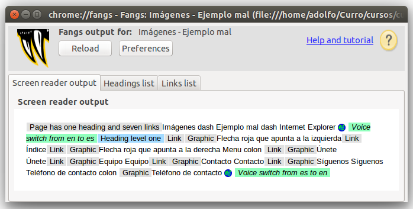

## Problemas

- En esta página existen **varios problemas**:

    - El texto alternativo que tienen las flechas describe las imágenes, pero **no indica su función**.
    - Las imágenes decorativas de las listas **repiten la descripción** del enlace.
    - La imagen que contiene un número de teléfono tiene un texto alternativo que **no es nada útil**.

## Soluciones

- Para que está página sea accesible existen **las siguientes soluciones**:

    - El texto alternativo de las flechas pasa a **indicar su función**: "Anterior" y "Siguiente".
    - El texto alternativo de las imágenes decorativas de las listas **lo dejamos vacío**.
    - El texto alternativo de la imagen con un número de teléfono lo hacemos **útil** indicando el número de teléfono.

## Buen uso de alt (I)

- Buen uso de alt cuando **describe la función de una imagen**

~~~

<a href="indice.html">Índice</a>

~~~

## Buen uso de alt (II)

- Buen uso de alt cuando **está vacío en imágenes decorativas**

~~~
<a href="unete.html">
  Únete</a>
~~~

## Buen uso de alt (III)

- Buen uso de alt cuando **el texto es útil**

~~~

  Teléfono de contacto:
  

~~~

## Fangs mejor

- Y ahora en **Fangs** se visiona mejor...

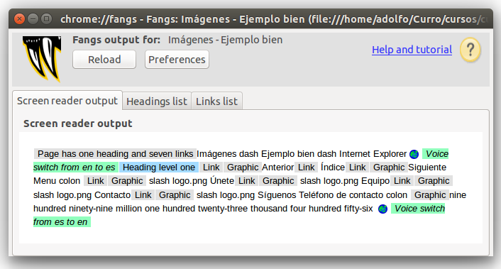

## Problemas menores

- En Fangs aparece un problema nuevo: **cuando una imagen no tiene texto alternativo muestra el valor del atributo src**.

- En la mayoría de los casos, este valor no es muy útil, ya que suele incluir nombres de directorios y el nombre del fichero.

## Imágenes decorativas (I)

- Lo mejor es **no incluir las imágenes decorativas en el HTML**

~~~
<ul>
  <li><a href="unete.html">Únete</a></li>
~~~

## Imágenes decorativas (II)

- Lo mejor es **emplear CSS** para su inclusión.

~~~
ul {
 list-style-image:
   url(./img/logo.png);
}
~~~

## Imágenes con texto (I)

- Lo mejor es **no usar imágenes para mostrar textos** sino usar textos directamente.

~~~
Teléfono de contacto: <strong>999123456</strong>
~~~

## Imágenes con texto (II)

- Lo mejor es **decorar el texto con CSS**.

~~~
strong {
  font-size: 2em
}
~~~

## Fangs mejor

- Y ahora en **Fangs** se visiona mucho mejor...

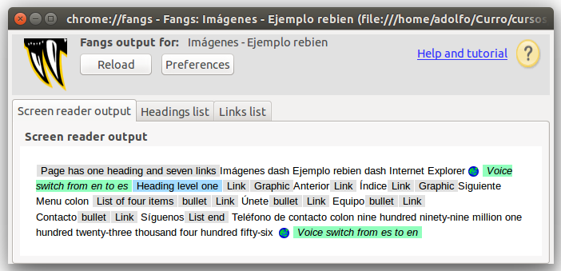

# Mapas de imagen

## ¿Qué son?

- Los mapas de imágenes permiten a los autores **especificar regiones en una imagen u objeto y asignar una acción** específica a cada región.

## Texto alternativo

- Para que sea accesible, se tiene que proporcionar un **texto alternativo con alt para cada etiqueta \<area\>**.

- Como cada zona activa realiza la misma función que un enlace, el texto alternativo tiene que **ser eficaz**, y tiene que **tener sentido cuando se lea fuera de contexto**.

## Ejemplo regular

- No utiliza la etiqueta \<object\>

~~~

<map name="map1" id="map1">
 <area href="index.html" alt="Inicio" >
~~~

## Visualización mal

- Así **Fangs** no muestra nada.

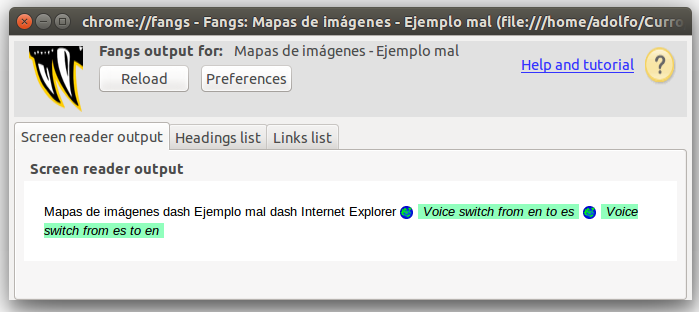

## Ejemplo bien

- Uutiliza la etiqueta \<object\>

~~~
<object data="img.png"
 type="image/jpg" usemap="#map1" >
 <map name="map1" id="map1">
  
Navegar por este sitio:
    <a href="index.html">Inicio</a>
~~~

## Visualización bien

- En **Fangs** ahora se ve correctamente:

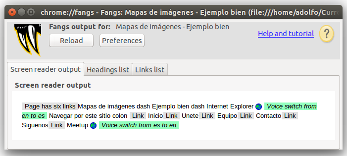

# Multimedia

## Poco accesibles

- Los elementos multimedia pueden ocasionar problemas de accesibilidad, ya no sólo a las personas con algún tipo de discapacidad, sino a todo el mundo en general, pues, aunque cada ve menos, en muchos casos, requieren la **instalación de plug-in**.

## Transcripción y subtítulos

- Se tiene que proporcionar **una transcripción de los diálogos y una descripción de los sonidos**.

- En el caso de los vídeos también se tiene que proporcionar **una descripción del vídeo en sí (de la imagen)**.

## YouTube (I)

- A principios de 2010, YouTube empezó a ofrecer un sistema para la **inclusión de subtítulos de forma automática**. Además, cualquiera puede crear un fichero de subtítulos y subirlo a YouTube para que sea empleado.

## YouTube (II)

- En YouTube, se puede emplear **"Filtros" de búsqueda** para indicar que se quiere buscar vídeos que tengan subtítulos.

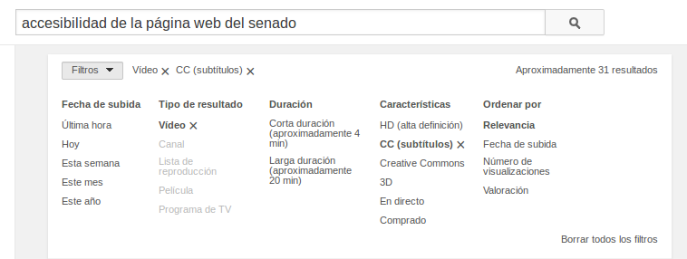

## YouTube (III)

- Los vídeos que tienen subtítulos aparecen en los resultados de una búsqueda con el marcador **"CC"** (del término inglés "Closed Captions" que significa "Subtítulos Cerrados")

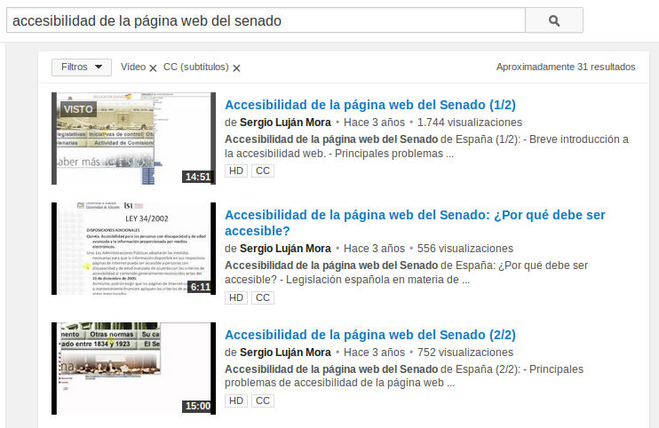

## YouTube (IV)

- Los subtítulos aparecen sobreimpresos sobre el vídeo.

## YouTube (V)

- Pinchando en el icono de subtítulos podemos activarlos y desactivarlos. Además, nos permite configurar algunos **parámetros de visualización** de los subtítulos, como el tipo de letra, el tamaño de letra y el más importante, el idioma de los subtítulos.

## YouTube (VI)

- YouTube permite añadir subtítulos en diferentes idiomas, y también permite emplear un servicio de **traducción automática** de los subtítulos.

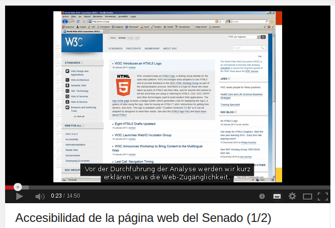

# Enlaces

## Fuera de contexto

- Algunos navegadores y algunos programas de ayuda permiten mostrar **la lista de enlaces de una página web**.

- Para que el enlace tenga sentido en esa lista de enlaces, **el texto del enlace tiene que tener sentido fuera de su contexto**.

## Evitar "Pincha aquí"

- Intenta **evitar los enlaces tipo "Pincha aquí"**:

## Ejemplo mal

~~~

Estabamos desayunando cuando de repente sucedió.
<a href="noticia-hija-mayor.html">Más información.</a>

~~~

## Ejemplo bien (HTML)

~~~

Estabamos desayunando cuando de repente sucedió.
<a href="noticia-hija-mayor.html">Más información
sobre la noticia titulada
"A mi hija mayor se le ha caído su primer diente".</a>

~~~

## Ejemplo bien (CSS)

~~~
span {
  position: absolute;
  left: -9999em;
  width: 1px;
  overflow: hidden;
}
~~~

## Ejemplo rebien

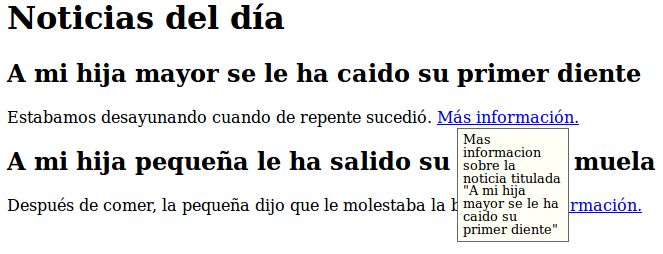

## Ejemplo rebien (HTML)

~~~

Estabamos desayunando cuando de repente sucedió.
<a href="noticia-hija-mayor.html">Más información
sobre la noticia titulada
"A mi hija mayor se le ha caído su primer diente".</a>

~~~

## Ejemplo rebien (CSS)

~~~
a:hover, a:focus, a:active {
  position: relative;
}
a:hover span, a:focus span, a:active span {
  left: 20px; top: 20px; width: 100px;
}
a:hover span:before, a:focus span:before, a:active span:before {
  content: "Mas informacion ";
}
~~~

## Tamaño

- Asegúrate que **los enlaces son lo suficiente grandes** para que sea fácil hacer click en ellos.

## Importancia primer enlace

- El primer enlace va a llevarse la mayor parte de la atención del lector y el mayor porcentaje de clicks.
- **Elige tu primer enlace cuidadosamente**.
- Empieza por lo importante y no lo malgastes en una trivialidad.

## No enlaces todo

- Usar demasiados enlaces hace el texto difícil de leer y además devalúa el valor de los enlaces importantes.
- Dedica algo de tiempo a pensar **qué es lo más importante que estás escribiendo y qué puede tener sentido enlazar**.

## No repitas los enlaces

- Si utilizas por primera vez algún término o concepto nuevo puedes enlazar a alguna enciclopedia o diccionario para que el lector encuentre más información si no sabe de qué hablas, pero **hazlo sólo la primera vez, no cada vez que se encuentre el término en la página**.

## Mismo idioma página

- Intenta enlazar en el mismo idioma de la página, y **si tienes que hacerlo, y no es obvio, indica el idioma del enlace** entre paréntesis.

## Comportamiento estándar

- **No alteres el comportamiento de los enlaces**, como por ejemplo poner previsualizaciones de la página que enlaza cuando se pasa el ratón por encima.

## Copiar y pegar

- **No enlaces cosas que el usuario puede querer seleccionar y copiar**, pues es bastante difícil hacerlo, incluso para una persona experta y sin discapacidad.

## Contenido independiente

- **No hagas el contenido dependiente de los enlaces para funcionar**.
- Es importante ofrecer el contexto necesario para hacer el contenido entendible sin la necesidad de visitar todo lo que está detrás de los enlaces.

## Los enlaces son enlaces

- Dales un estilo distintivo **que no pueda ser confundido** con ningún otro elemento o texto de la página.
- Usa un color único no usado en ninguna otra parte de la página y **considera usar la convención de un enlace subrayado**.
- Usa el **mismo diseño para todos los enlaces** del site.

## No ofusques tus URLs

- Los usuarios pueden querer ver previamente dónde van a ser enviados con tu enlace poniendo el ratón encima y viendo la URL en la barra de estado.
- **Evita utilizar redirecciones y servicios acortadores de URLs** que hacen la URL totalmente opaca.

## Comprueba los enlaces

- Visítalos antes de enlazar, copia correctamente la URL y una vez publicado **recuerda pulsarlos para comprobar** que funcionan correctamente.
- No hay nada más frustrante en la Red que un enlace mal puesto o estropeado.

# Organización de las páginas

## Elementos estructurales

- Las páginas web tienen que estar correctamente estructuradas.
- Para ello, se tienen que **emplear las etiquetas de HTML que definen la estructura de una página**, como son: \<title\>, \<h1\>, \<h2\>, ..., \<ul\>, \<ol\>, \<p\>, \<blockquote\>.

## title (I)

- Toda página web debe tener un título  **descriptivo pero a la vez breve** definido con **la etiqueta \<title\> que resuma el contenido o la función** de la página.

- Es conveniente **incluir el nombre del sitio web** para definir el contexto de la página.

## title (II)

- El título de la página se emplea:
    - en los **marcadores de los navegadores**,
    - en los **resultados que muestran los buscadores**,
    - y suele ser el **texto que se comparte en las redes sociales**.

## title (III)

- El título de la página **es lo primero que leen los lectores de pantalla**.

- Como se lee en todas las páginas, **debe ser corto y no debe ser el mismo en todas las páginas**.

## Encabezados (I)

- El contenido de las páginas se tiene que estructurar con las **etiquetas de encabezado \<h1\>, \<h2\>, ...**

## Encabezados (II)

- La mayoría de los lectores de pantalla y algunos navegadores permiten al usuario desplazarse dentro de una página web "saltando" de un encabezado a otro encabezado, lo **permite llegar de una forma más rápida a la información que se busca**.

## Encabezados (III)

- Utiliza **un único encabezado \<h1\> para el título principal** de la página web.

- Utiliza **diferentes encabezados \<h2\> para cada apartado principal** de la página.

- Emplea **el resto de encabezados (\<h3\> ... <\h6\>) para añadir mayor nivel de detalle** en la estructura de la página.

## Encabezados (IV)

- Se consistente en el uso de los encabezados: por ejemplo, **no pases de \<h2\> a \<h4\> sin utilizar \<h3\>**.

## Encabezados (V)

- Si no quieres que se vean los encabezados en un navegador visual, **utiliza CSS para esconderlos**.

- Para ello, **no utilices display: none;** si no desplaza el encabezado fuera del área de visualización con posicionamiento absoluto, por ejemplo, **position: absolute; top: -500px;**.

## Maquetación (I)

- Muchos desarrolladores de páginas web emplean las etiquetas \<div\> y \<span\> para definir encabezados de sección y estructurar el contenido, sin embargo, estas etiquetas **\<div\> y \<span\> no proporcionan contenido semántico**, por lo que se debe evitar su uso.

## Maquetación (II)

- En una página web **nunca se deben utilizar las tablas para maquetar**, ya que suponen un grave problema de accesibilidad.

## HTML5

- Sin perder de vista todo lo mencionado anteriormente, **se pueden empezar a usar las nuevas etiquetas semánticas y estructurales de HTML5**: \<header\>, \<hgroup\>, \<nav\>, \<article\>, \<aside\> o \<footer\>.

## header (I)

- La etiqueta **\<header\> se usa para marcar un grupo de elementos de introducción o de navegación** dentro de una sección o documento.

## header (II)

- El uso de la etiqueta **\<header\> no está restringido a una por documento**:

~~~
<header>
 <h1>Título del documento</h1>
 
Más información

</header>
<article>
 <header>
  <h2>Título del artículo</h2>
  
Autor del artículo

 </header>
 
Texto del artículo

</article>
~~~

## header (III)

- Si sólo tenemos un elemento no es necesario usar esta etiqueta:

~~~
<article>
 <header>
  <h1>Título del artículo</h1>
 </header>
 
Texto del artículo

</article>
~~~

## header (IV)

- Sería más correcto de esta forma:

~~~
<article>
 <h1>Título del artículo</h1>
 
Texto del artículo

</article>
~~~

## hgroup (I)

- La etiqueta **\<hgroup\> se usa para agrupar un conjunto de elementos de encabezado** (\<h1\>–\<h6\>).

- El uso más típico de esta etiqueta es para **agrupar el título de la página con su eslogan**.

## hgroup (II)

- Antes de HTML5 lo más típico era que este tipo de estructura se marcase así:

~~~

 <h1>Nombre de la empresa</h1>
 
Eslogan de la empresa

 <h2>Noticia 1</h2>
 
Desarrollo de la noticia 1

 <h2>Noticia 2</h2>
 
Desarrollo de la noticia 2

~~~

## hgroup (III)

- Este tipo de estructura dejaba el eslogan al nivel de cualquier otro texto de la web, cuando es evidente que es un texto más importante.

- Marcarlo con un \<h2\> no era correcto ya que crearía una nueva sección que en realidad no existe. 

## hgroup (IV)

- Con HTML5 podemos usar \<hgroup\> para darle la importancia que realmente tiene, asociándolo al título:

~~~
<hgroup>
 <h1>Nombre de la empresa</h1>
 <h2>Eslogan de la empresa</h2>
</hgroup>
<article>
 <h2>Noticia 1</h2>
 
Texto del artículo

</article>
~~~

## nav

- La etiqueta **\<nav\> se usa para marcar la navegación** de la página web.

- Esta etiqueta **no debe ser usada para marcar todos los grupos de enlaces**, únicamente los bloques principales de navegación por la página.

## article

- La etiqueta **\<article\> se usa para marcar contenido independiente que tendría sentido fuera del contexto de la página actual y que podría sindicarse**, por ejemplo: una noticia, un artículo en un blog o un comentario.

- Normalmente un \<article\> podrá además tener de su propio contenido, también una cabecera (\<header\>) y posiblemente un pie (\<footer\>).

## section

- La etiqueta **\<section\> se usa para marcar una sección genérica** de un documento o aplicación, típicamente con un encabezado (\<header\>).

- Sólo se debería usar \<section\> para contenido independiente al que se podría poner un encabezado y que no sea susceptible de ir marcado con \<article\>, \<aside\> o \<nav\>.

## article VS section

- Ejemplo típico del uso de \<section\> y \<article\>:

~~~
<h1>Nombre de la empresa</h1>
<section id="news-list">
 <h2>Noticias</h2>
 <article>
  <h3>Noticia 1</h3>
  
Desarrollo de la noticia 1

 </article>
 <article>
  <h3>Noticia 2</h3>
  
Desarrollo de la noticia 2

 </article>
</section>
~~~

## aside

- La etiqueta **\<aside\> se usa para marcar un trozo de contenido que está relacionado con el contenido de la página web, pero que no es parte del mismo**. Ejemplos de uso serían: glosario de términos, grupos de enlaces a páginas relacionadas, barras laterales, ...

## footer

- La etiqueta **\<footer\> se usa para marcar el pie de una sección o documento** y que contiene información sobre el mismo como el autor, licencia, términos de uso, ...

# Figuras y diagramas

## longdesc (I)

- Cuando se utilizan imágenes en una web la práctica habitual es darles un **texto alternativo mediante el atributo alt, o dejar vacío dicho atributo en el caso de que la función de la imagen sea meramente decorativa**.

- Pero nos podemos encontrar con el caso de tener una imagen a la que haya que asociarle un texto alternativo, pero dicho **texto sea excesivamente largo**, para esas ocasiones está el atributo longdesc.

## longdesc (II)

- El **atributo longdesc ha de ser siempre una URL que lleve a una descripción de la imagen**, en la misma o en otra página.

- Se puede dar una **URL externa** o, como en el ejemplo expuesto más adelante, **un marcador de página**.

## longdesc (III)

- Si no se quiere mostrar la descripción larga **se puede esconder con CSS**, pero para ello, **no usar display: none;** si no desplazar el elemento fuera del área de visualización con posicionamiento absoluto, por ejemplo, **position: absolute; left: -9999em;**.

## Ejemplo mal

~~~

~~~

## Ejemplo bien (HTML)

~~~

El Diseño Centrado en el usuario tiene varias fases: planificación, diseño, prototipado, evaluación, implementación y lanzamiento, mantenimiento y seguimiento
~~~

## Ejemplo bien (CSS)

~~~
span {
  position: absolute;
  left: -9999em;
  width: 1px;
  overflow: hidden;
}
~~~

# Scripts

## Poco accesibles (I)

- Algunos de los navegadores que emplean las personas discapacitadas **no son capaces de interpretar el código de JavaScript** o algunos elementos multimedia como applets u objetos que requieren de un plug-in.

## Poco accesibles (II)

- Por regla general, **el HTML Dinámico no funcionará con un navegador no visual y no será accesible**.

- La solución es lograr que una página web funcione correctamente **sin necesidad de tener que ejecutar el código JavaScript**.

## Graceful degradation

- Se crea una página web **para los últimos navegadores**, con la posibilidad de que funcione en navegadores antiguos.

## Progressive enhancement

- Se parte de una **versión básica completamente operativa**, con la posibilidad de ir añadiendo mejoras para los últimos navegadores. Es la opción más utilizada hoy en día.

## Capas (I)

- Una página web se puede construir mediante capas:

    - **Capa de contenido**: la estructura y el contenido con etiquetas de XHTML.
    - **Capa de presentación**: la presentación del contenido definida con CSS.
    - **Capa de comportamiento**: el comportamiento del contenido (por ejemplo, la respuesta ante una acción del usuario) definido con JavaScript.

## Capas (II)

- Separar contenido (HTML), de presentación (CSS), de comportamiento (Javascript)

## Capas (III)

- Con un diseño basado en capas logramos:
    - **reducir el acomplamiento** entre los distintos componentes (contenido, presentación y comportamiento),
    - **disminuimos los errores**,
    - **reducción en los costes de mantenimiento**, etc.

## Eventos JS

- Asignar código JavaScript a un manejador de eventos con el siguiente código:

~~~
elemento.evento = acccion;
~~~

## Selección JS

- Seleccionar elementos de la página web mediante JavaScript:

    - **getElementById(id)**: selecciona el elemento indicado por el id.
    - **getElementsByTagName(etiqueta)**: selecciona los elementos por tipo de etiquetas
    - **querySelector(selectors)**: selecciona el primer elemento seleccionado
    - **querySelectorAll(selectors)**: selecciona los elementos seleccionados
    - **getAttribute(atributo)**: para seleccionar los atributo de un elemento

## Ejemplo mal

~~~
<a href=""
onclick="alert('Hola Mundo')">
Pincha para ver un "Hola Mundo" en Javascript</a>
~~~

## Ejemplo bien (HTML)

~~~
<a href="">
Pincha para ver un "Hola Mundo" en Javascript</a>
~~~

## Ejemplo bien (JS)

~~~
window.onload = function() {
 var link = document.querySelector("a");
 link.onclick = function() {
  alert("Hola Mundo");
 }
}
~~~

# Frames

## Poco accesibles

- Los frames son un elemento del HTML que **siempre han causado problemas**.

    - no se puede enlazar a una combinación particular de marcos, 
    - no se llevan bien con los buscadores,
    - se puede llegar a una situación de múltiples marcos anidados, etc.

## Evitar uso

- De cara a lograr la máxima accesibilidad posible, es mejor **evitar el uso de marcos**.

- Hoy en día, existen diferentes técnicas para incluir automáticamente un elemento, como un menú de navegación o un pie de página en un lugar determinado de todas las páginas, con lo que se consigue la misma función que con el uso de marcos pero sin sus inconvenientes.

# Tablas

## Difíciles de entender

- Una tabla de datos es **muy difícil de entender si sólo se puede ver un dato aislado** cada vez, que es el problema que sufren los usuarios que emplean navegadores no visuales.

- Para evitar este problema, se tienen que **etiquetar correctamente** las tablas.

## caption

- Poner **un título que proporcione una descripción breve en la etiqueta \<caption\>**, justo después de la etiqueta \<table\>.

## summary

- Poner **un resumen que complemente al título en el atributo summary** de la etiqueta \<table\>:
    - con la estructura de la tabla (número de fílas, número de columnas)
    - con la descripción de los encabezamientos
    - con la relación que guarda la tabla con el resto de la página, etc.

## th

- Definir los **encabezados tanto verticales como horizontales con la etiqueta \<th\>**.

## Ejemplo mal

~~~
<table>
  <tr>
   <td></td>
   <td><strong>Lunes</strong></td>
   <td><strong>Martes</strong></td>
  </tr>
  <tr>
   <td><strong>10:00</strong></td>
   <td>Matemáticas</td>
   <td>Matemáticas</td>
  </tr>
  <tr>
   <td><strong>11:00</strong></td>
   <td>Lengua</td>
   <td>Lengua</td>
  </tr>
</table>
~~~

## Ejemplo bien

~~~
<table summary="5 columnas (días de la semana) y 4 filas (horas)">
 <caption>Horario de clase</caption>
 <tr>
  <th></th>
  <th id="columnaLunes">Lunes</th>
 </tr>
 <tr>
  <th id="filaHora10">10:00</th>
  <td
   headers="columnaLunes filaHora10">
    Matemáticas</td>
 </tr>
</table>
~~~

#  Formularios

## label

- Asegúrate de que cada elemento de un formulario tiene asociada una **etiqueta \<label\>**.

## Ejemplo mal

~~~
<form method="post" action="#">
 
<strong>Información personal</strong>

  Nombre:
   <input type="text" required > 
~~~

## Ejemplo bien

~~~
<form name="contacto" method="post" action="#">
 <fieldset>
  <legend>Información personal</legend>
   <label for="nombre" tabindex="1">Nombre:</label>
   <input type="text" id="nombre" name="nombre" autofocus required  >  
~~~

# Elementos repetitivos

## Problema

- Suele ser molesto **cuando se navega con un lector de pantalla que cada vez que se recarga una página vuelve a repetir de nuevo la cabecera** que suele ser idéntica.

## Solución

- Proporciona un método (por ejemplo un enlace **"Saltar al contenido"** en la parte superior de la página) que permita saltarse la navegación u otros elementos que se repiten en cada página.

# Validadores

## De HTML

- W3C Markup Validation Service
    - <http://validator.w3.org>

- WDG HTML Validator
    - <http://www.htmlhelp.com/tools/validator>

## De CSS

- W3C CSS Validation Service
    - <http://jigsaw.w3.org/css-validator>

- WDG CSS Check
    - <http://www.htmlhelp.com/tools/csscheck>

## De enlaces

- W3C Link Checker
    - <http://validator.w3.org/checklink>

- WDG Link Valet
    - <http://www.htmlhelp.com/tools/valet>

- Link Checker
    - <http://wummel.github.io/linkchecker>

## Otros validadores

- W3C mobileOK Checker
    - <http://validator.w3.org/mobile>

- W3C Feed Validation Service
    - <http://validator.w3.org/feed>

- W3C Semantic Data Extractor
    - <http://www.w3.org/2003/12/semantic-extractor.html>

## Unificados

- W3C Unicorn
    - <http://validator.w3.org/unicorn>

## Accesibilidad (I)

- WAVE Web Accessibility Tool
    - <http://wave.webaim.org>

- WAVE Web Accessibility Toolbar for Firefox
    - <http://wave.webaim.org/toolbar>

- CynthiaSays
    - <http://www.cynthiasays.com>

## Accesibilidad (II)

- eXaminator
    - <http://examinator.ws>

- AChecker
    - <http://achecker.ca/checker>

- Nibbler
    - <http://nibbler.silktide.com>

## Accesibilidad (III)

- Tingtun Checker
    - <http://accessibility.tingtun.no/en/pagecheck2.0>

- Functional Accessibility Evaluator
    - <http://fae20.cita.illinois.edu>

- SortSite - Accessibility Checker and Validator
    - <http://www.powermapper.com/products/sortsite/checks/accessibility-checks.htmlhelp>

# Otras Herramientas

## Plugins

- Web Developer, no ofrece **muchísima información útil** para comprobar que una página web es accesible.
    - <https://addons.mozilla.org/es/firefox/addon/web-developer/>
    - Ver explicación: <http://accesibilidadweb.dlsi.ua.es/?menu=hr-webdevelopertoolbar>

- Fangs Screen Reader Emulator, **emula el comportamiento que tendría un lector de pantallas**.
    - <https://addons.mozilla.org/en-us/firefox/addon/fangs-screen-reader-emulator>

## Colores

- Accessibility Color Wheel
    - <http://gmazzocato.altervista.org/colorwheel/wheel.php>

- Colorblind Web Page Filter
    - <http://colorfilter.wickline.org>

- Check My Colours
    - <http://www.checkmycolours.com>

## Paletas de colores

- Paletton
    - <http://paletton.com>

- Color Palette Generator
    - <http://www.degraeve.com/color-palette>

## Tiempo de carga

- Load Impact
    - <http://loadimpact.com>

- Pingdom Website Speed Test
    - <http://tools.pingdom.com/fpt>

- Site Speed
    - <http://sitespeed.me>

- Web Page Analyzer
    - <http://www.webpageanalyzer.com>

# Acerca de

## Licencia

- Estas **transparencias** están hechas con:
    - MarkdownSlides: <https://github.com/asanzdiego/markdownslides>

- Estas **transparencias** están bajo una licencia Creative Commons Reconocimiento-CompartirIgual 3.0:
    - <http://creativecommons.org/licenses/by-sa/3.0/es>

## Fuentes

- Transparencias:
    - <https://github.com/asanzdiego/curso-interfaces-web-2014/02-accesibilidad/slides>

- Código:
    - <https://github.com/asanzdiego/curso-interfaces-web-2014/02-accesibilidad/src>

## Bibliografía (I)

- Página de Accesibilidad Web de la Universidad de Alicante
    - <http://accesibilidadweb.dlsi.ua.es>

- Traducción: Pautas de Accesibilidad para el Contenido Web (WCAG) 2.0
    - <http://www.sidar.org/traducciones/wcag20/es>

## Bibliografía (II)

- Enlazar es importante
    - <http://www.microsiervos.com/archivo/weblogs/enlazar-es-importante-3.html>

- Enlaces para “leer más” que sean simples y accesibles
    - <http://www.torresburriel.com/weblog/2005/10/22/enlaces-para-leer-mas-que-sean-simples-y-accesibles>

- Javascript no obstructivo, Manual de buenas maneras
    - <http://www.anieto2k.com/2006/10/15/javascript-no-obstructivo-manual-de-buenas-maneras>

## Bibliografía (III)

- HTML5: Nuevas etiquetas semánticas y estructurales
    - <http://www.arumeinformatica.es/blog/html5-nuevas-etiquetas-semanticas-y-estructurales>

- HTML y Accesibilidad: el atributo longdesc en imágenes
    - <http://blog.outbook.es/desarrollo-web/html-y-accesibilidad-el-atributo-longdesc-en-imagenes>

- Nuevos tipos de input en HTML5
    - <http://www.htmlcinco.com/nuevos-tipos-de-input-en-html5>

## Bibliografía (IV)

- Lectores de pantalla
    - <http://es.wikipedia.org/wiki/Lector_de_pantalla>

- Validadores y herramientas de accesibilidad y usabilidad
    - <http://www.usableyaccesible.com/recurso_misvalidadores.php>

- Web Accessibility Evaluation Tools: Overview
    - <http://www.w3.org/WAI/ER/tools/Overview.html>
