% Bootstrap, un framework CSS
% Adolfo Sanz De Diego
% Septiembre 2014

# El autor

## Adolfo Sanz De Diego

- **Antiguo programador web JEE (6 años)**

- Hoy en día:

    - **Profesor de FP (6 años)**:
        - Hardware, Sistemas Operativos
        - Redes, Programación

    - **Formador Freelance (3 años)**:
        - Java, Android
        - JavaScript, jQuery
        - JSF, Spring, Hibernate
        - Groovy & Grails

## Algunos proyectos

- Fundador y/o creador:

    - **Hackathon Lovers**: <http://hackathonlovers.com>
    - **Tweets Sentiment**: <http://tweetssentiment.com>
    - **MarkdownSlides**: <https://github.com/asanzdiego/markdownslides>

- Co-fundador y/o co-creador:

    - **PeliTweets**: <http://pelitweets.com>
    - **Password Manager Generator**: <http://pasmangen.github.io>

## ¿Donde encontrarme?

- Mi nick: **asanzdiego**

    - AboutMe:  <http://about.me/asanzdiego>
    - GitHub:   <http://github.com/asanzdiego>
    - Twitter:  <http://twitter.com/asanzdiego>
    - Blog:     <http://asanzdiego.blogspot.com.es>
    - LinkedIn: <http://www.linkedin.com/in/asanzdiego>
    - Google+:  <http://plus.google.com/+AdolfoSanzDeDiego>

# Introducción

## ¿Qué es?

- Boostrap es un **framework CSS, liberado por Twitter** y muy popular hoy en día.

- Está pensado para hacer un desarrollo **Mobile First**

## Ventajas (I)

- Utiliza componentes y servicios creados por la **comunidad web**.

- Utiliza un conjunto de **buenas prácticas** que perdurarán en el tiempo.

- Utiliza **HTML5 y CSS3**

## Ventajas (II)

- Implementa un **sistema de rejillas**, que por defecto incluye 12 columnas.

- Utiliza **LESS**, un preprocesador CSS. (Ahora también soporta Saas).

- Es **OOCSS**, osea CSS Orientado a Objetos: organizado por módulos independientes y reutilizables.

## Ventajas (III)

- Hay una enorme **comunidad detrás**.

- Herramienta **sencilla y ágil** para construir sitios web e interfaces.

- Tiene un **theme** por defecto bastante optimizado y que puedes modificar fácilmente.

## Desventajas (I)

- Es necesario **adaptarse a su forma de trabajo**, si bien su curva de aprendizaje es liviana, deberás comprender y familiarizarte con su estructura y nomenclatura.

- Debes adaptar tu diseño a un grid de **12 columnas**.

- Trae **anchos y márgenes por defecto**, que a veces son un poco tediosos de cambiar.

## Desventajas (II)

- Es complicado **cambiar de versión** si has realizado modificaciones profundas sobre el core.

- Si necesitas **añadir componentes que no existen**, debes hacerlos tú mismo en CSS y cuidar de que mantenga coherencia con tu diseño y cuidando el responsive.

- A veces hacer **implementar un diseño impuesto**, puede llegar a resultar bastante difícil, al menos si eres un perfeccionista.

## Descarga

- Si sólo quieres **lo fundamental**:

    - <https://github.com/twbs/bootstrap/releases/download/v3.2.0/bootstrap-3.2.0-dist.zip>

~~~
bootstrap/
├── css/
│   ├── bootstrap.css
│   ├── bootstrap.min.css
│   ├── bootstrap-theme.css
│   └── bootstrap-theme.min.css
├── js/
│   ├── bootstrap.js
│   └── bootstrap.min.js
└── fonts/
~~~

## Plantilla básica

~~~
<!DOCTYPE html>
<html lang="en">
  <head>
    <meta name="viewport"...>
    <title>Template</title>
    <link href="bootstrap.min.css"...>
  </head>
  <body>
    <h1>Hello, world!</h1>
    
    
  </body>
</html>
~~~

# Resumen CSS

## HTML5 doctype

- Bootstrap necesita un **doctype de HTML5**:

~~~
<!DOCTYPE html>
<html lang="en">
  ...
</html>
~~~

## Mobile first

- Desde la versión 3, Boostrap es **Mobile first**.

- Para garantizar un buen renderizado y un buen funcionamiento del zoom:

~~~
<meta name="viewport"
   content="width=device-width,
            initial-scale=1">
~~~

## Desactivar zoom (I)

- Se puede desactivar el zoom con **user-scalable=no**

~~~
<meta name="viewport"
   content="width=device-width,
            initial-scale=1,
            maximum-scale=1,
            user-scalable=no">
~~~

## Desactivar zoom (II)

- Hace que el sitio se parezca más una aplicación nativa, pero también lo hace **menos accesible**. En general, no se recomienda.

## Normalize.css

- Para un **mejor renderizado** en varios navegadores, Boostrap usa Normalize.css, un proyecto desarrollado por Nicolas Gallagher y Jonathan Neal:

    - <http://necolas.github.io/normalize.css/>

# Grid system

## Introducción

- Bootstrap incluye un **sistema de rejilla responsive y mobile first de 12 columnas**.

## Funcionamiento

- El sistema de rejilla de Bootstrap **funciona así**:

    - Se deben colocar .row dentro de un **.container** (ancho fijo) o **.container-fluid** (ancho completo).
    - Utilice **.row** para crear grupos horizontales.
    - El contenido se debe colocar entre .row y deben de ser **hijos inmediatos**.
    - Si hay más de 12 columnas en una .row, esta son desplazadas abajo.

## 1 columna (I)

- Ejemplo de 1 columna de un tamaño de 12

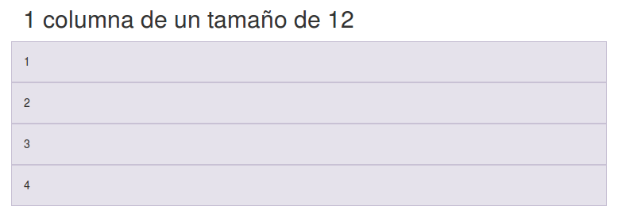

## 1 columna (II)

- Ejemplo de 1 columna de un tamaño de 12

~~~

  
1

  
2

  
3

  
4

~~~

## 2 columnas (I)

- Ejemplo de 2 columnas de un tamaño de 6

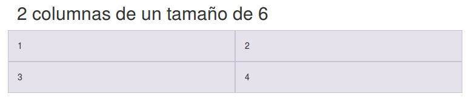

## 2 columnas (II)

- Ejemplo de 2 columnas de un tamaño de 6

~~~

  
1

  
2

  
3

  
4

~~~

## 3 columnas (I)

- Ejemplo de 3 columnas de un tamaño de 4

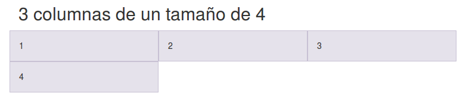

## 3 columnas (II)

- Ejemplo de 3 columnas de un tamaño de 4

~~~

  
1

  
2

  
3

  
4

~~~

## 4 columnas (I)

- Ejemplo de 4 columnas de un tamaño de 3

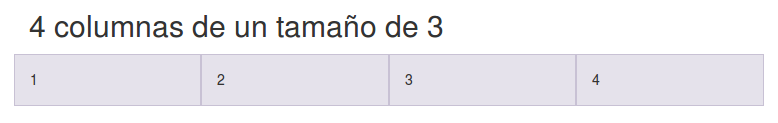

## 4 columnas (II)

- Ejemplo de 4 columnas de un tamaño de 3

~~~

  
1

  
2

  
3

  
4

~~~

## Multidispositivo

- 1 columna para xs (\<768px)
- 2 columnas para sm (≥768px)
- 3 columnas para md (≥992px)
- 4 columnas para lg (≥1200px)

## Normal

~~~

  
1

  
2

  
3

  
4</didv>

~~~

## clearfix (I)

- Problema cuando una capa tiene un alto mayor que la de los demás:

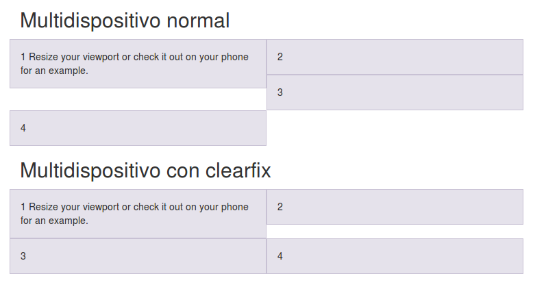

## clearfix (II)

~~~

  
1
    Resize your viewport

  
2

  

  
3

  

  
4</didv>

~~~

## Huecos con offset (I)

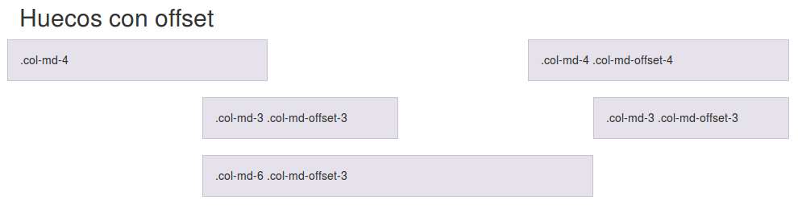

## Huecos con offset (II)

~~~

  

    .col-md-4

  

    .col-md-4 .col-md-offset-4

~~~

## Huecos con offset (III)

~~~

  
.col-md-3
      .col-md-offset-3

  
.col-md-3
      .col-md-offset-3

~~~

## Huecos con offset (IV)

~~~

  
.col-md-6
      .col-md-offset-3

~~~

## push & pull (I)

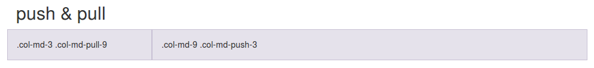

## push & pull (II)

~~~

  

    .col-md-9 .col-md-push-3

  

    .col-md-3 .col-md-pull-9

~~~

## Media Queries (I)

- Estas son las Media Queries que se usan:

~~~
/* Extra small devices
   (phones, less than 768px) */
/* default in Bootstrap */

/* Small devices
   (tablets, 768px and up) */
@media (min-width: @screen-sm-min) {}

/* Medium devices
   (desktops, 992px and up) */
@media (min-width: @screen-md-min) {}

/* Large devices
   (large desktops, 1200px and up) */
@media (min-width: @screen-lg-min) {}
~~~

## Media Queries (II)

- A veces también usan max-witdh para limitar ciertas reglas.

~~~
@media (max-width: @screen-xs-max) {}

@media (min-width: @screen-sm-min)
    and (max-width: @screen-sm-max) {}

@media (min-width: @screen-md-min)
    and (max-width: @screen-md-max) {}

@media (min-width: @screen-lg-min) {}
~~~

# Tipografía

## Cabeceras (I)

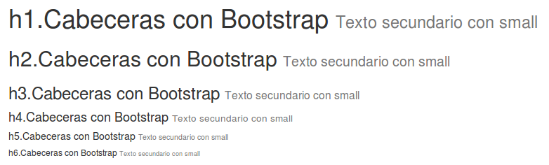

## Cabeceras (II)

~~~
<h1>h1.Cabeceras con Bootstrap
  <small>Texto secundario</small></h1>

<h2>h2.Cabeceras con Bootstrap
  <small>Texto secundario</small></h2>
~~~

## Párrafos (I)

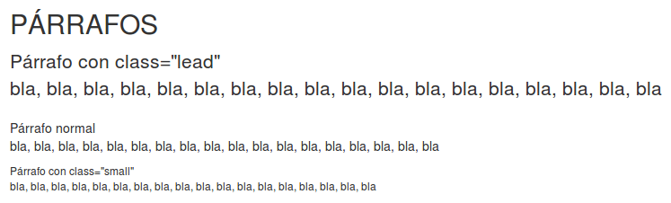

## Párrafos (II)

~~~

  Párrafo con class="lead"

Párrafo normal

  Párrafo con class="small"

~~~

## Textos en línea

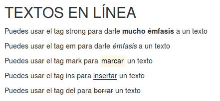

## strong

- mucho émfasis

~~~

Puedes usar el tag strong para darle <strong>mucho émfasis</strong> a un texto

~~~

## em

- émfasis

~~~

Puedes usar el tag em para darle <em>émfasis</em> a un texto

~~~

## mark

- marcar

~~~

Puedes usar el tag mark para <mark>marcar</mark> un texto

~~~

## ins

- insertar un texto (mejor que subrallar)

~~~

Puedes usar el tag ins para <ins>insertar</ins> un texto

~~~

## del

- borrar un texto (mejor que tachar)

~~~

Puedes usar el tag del para <del>borrar</del> un texto

~~~

## Alineación

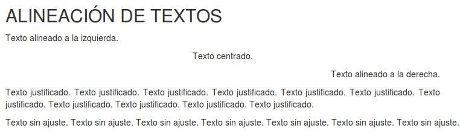

## Izquierda

- Texto alineado a la izquierda.

~~~

Texto alineado a la izquierda.

~~~

## Centrado

- Texto centrado.

~~~

Texto centrado.

~~~

## Derecha

- Texto alineado a la derecha.

~~~

Texto alineado a la derecha.

~~~

## Justificado

- Texto justificado.

~~~

Texto justificado.

~~~

## Sin ajuste

- Texto sin ajuste.

~~~

Texto sin ajuste.

~~~

## Capitalización

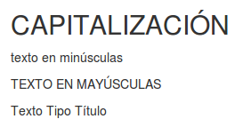

## Minúsculas

- Minúsculas

~~~

Lowercased text.

~~~

## Mayúsculas

- Mayúsculas

~~~

Uppercased text.

~~~

## Tipo Título

- Tipo Título

~~~

Capitalized text.

~~~

## Abreviaturas (I)

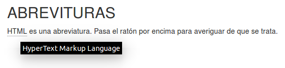

## Abreviaturas (II)

~~~
<abbr title="HyperText Markup Language">HTML</abbr> es una abreviatura. Pasa el ratón por encima para averiguar de que se trata.
~~~

## Direcciones (I)

## Direcciones (II)

~~~
<address>
  <strong>Twitter, Inc.</strong> 
  795 Folsom Ave, Suite 600 
  San Francisco, CA 94107 
  <abbr title="Phone">P:</abbr>
  (123) 456-7890
</address>

<address>
  <strong>Full Name</strong> 
  <a href="mailto:#">info@name.com</a>
</address>
~~~

## Citas (I)

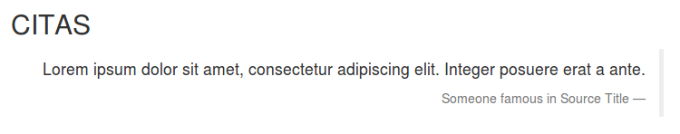

## Citas (II)

~~~
<blockquote class="blockquote">

  
Lorem ipsum dolor sit amet, consectetur adipiscing elit. Integer posuere erat a ante.

  <footer>Someone famous in <cite title="Source Title">Source Title</cite></footer>

</blockquote>
~~~

## Listas (I)

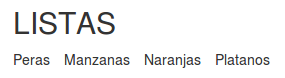

## Listas (II)

~~~
<ul class="list-inline">
  <li>Peras</li>
  <li>Manzanas</li>
  <li>Naranjas</li>
  <li>Platanos</li>
</ul>
~~~

## Descripciones (I)

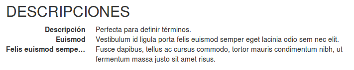

## Descripciones (II)

~~~
<dl class="dl-horizontal">
  <dt>Descripción</dt>
  <dd>Perfecta para definir.</dd>
  <dt>Euismod</dt>
  <dd>Vestibulum id ligula...</dd>
  <dt>Felis euismod semper eget</dt>
  <dd>Fusce dapibus, tellus ...</dd>
</dl>
~~~

# Tablas

## Clases

- **table**: para darle el formato
- **table-striped**: para darle formato a las pares y a las impares
- **table-bordered**: para ponerle bordes a la tabla
- **table-hover**: para oscurecer la fila en donde está el ratón
- **table-condensed**: para que ocupe menos espacio

## Responsive

- Poniendo la tabla dentro de una **capa con class=table-responsive** aparecerá un scroll horizontal en la tabla en dispositivos pequeños.

## Ejemplo (I)

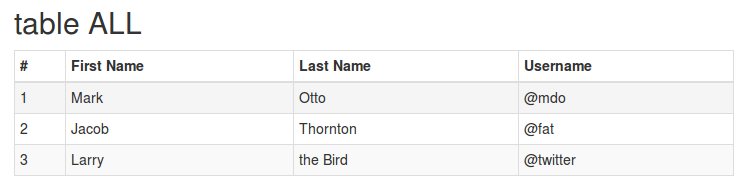

## Ejemplo (II)

~~~

  <table class="table table-striped  table-bordered table-hover table-condensed">
    <thead>
      <tr>
        <th>...
    </thead>
    <tbody>
      <tr>
        <td>...
    </tbody>
  </table>

~~~

# Formularios

## Lo básico (I)

- Agrupar label + control con **class=form-group**

- Input, textarea y select con **class=form-control**

## Lo básico (II)

- Layouts: **normal, form-inline y form-horizontal**

- Para distribuir el contenido, se puede **usar .col- pero no hace falta usar .row**

## Normal

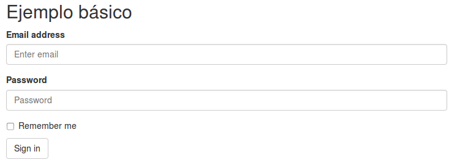

## Inline

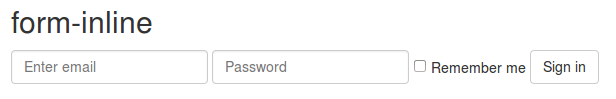

## Horizontal

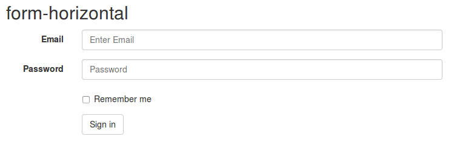

## Ejemplo

~~~
<form class="form" role="form">
  

    <label for="inputEmail3"
      class="col-sm-2 control-label">
      Email</label>
    

      <input class="form-control"
       id="inputEmail3"
       placeholder="Enter Email"
       type="email">
    

  

  

    

      <button type="submit"
        class="btn btn-default">
        Sign in</button>
    

  

</form>
~~~

## Inputs

- Los de **HTML5**: text, password, datetime, datetime-local, date, month, time, week, number, email, url, search, tel, and color.

## Checkboxes and radios

- Se puede usar **class=checkbox-inline** o **class=radio-inline**

~~~

  <label>
    <input type="radio"
      name="optionsRadios"
      id="optionsRadios1"
      value="option1" checked>
      checked</label>

  <label>
    <input type="radio"
      name="optionsRadios"
      id="optionsRadios3"
      value="option3" disabled>
      disabled</label>

~~~

## Validaciones (I)

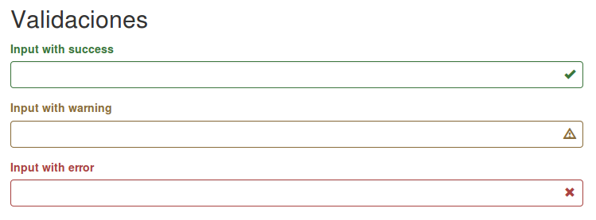

## Validaciones (II)

- Usar los helpers **has-success, has-warning y has-error**

~~~

  <label class="control-label"
    for="inputSuccess2">
    Input with success</label>
  <input type="text"
    class="form-control"
    id="inputSuccess2">
  

~~~

## Tamaños (I)

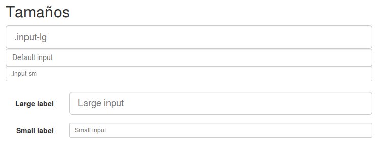

## Tamaños (II)

- Usar los helpers **form-group-lg o form-group-sm** o bien, en caso de inputs aislados que no estén dentro de un form-group, usar **input-lg o input-sm**

~~~
<form class="form-horizontal"
  role="form">
  

    <label class="col-sm-2
      control-label"
      for="formGroupInputLarge">
      Large label</label>
    

      <input class="form-control"
        type="text"
        id="formGroupInputLarge"
        placeholder="Large input">
    

  

</form>
~~~

## Tamaños (III)

- Usar los helpers **form-group-lg o form-group-sm** o bien, en caso de inputs aislados que no estén dentro de un form-group, usar **input-lg o input-sm**

~~~
<form class="form-horizontal" role="form">
  

    <label class="col-sm-2
      control-label"
      for="formGroupInputSmall">
      Small label</label>
    

      <input class="form-control"
        type="text"
        id="formGroupInputSmall"
        placeholder="Small input">
    

  

</form>
~~~

# Botones

## Ejemplos

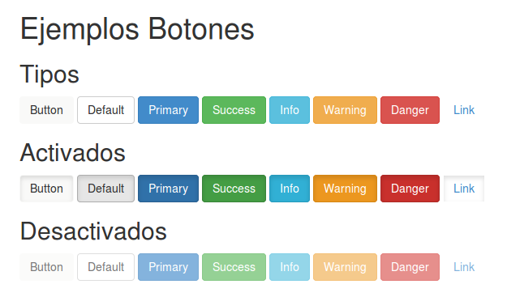

## Tipos (I)

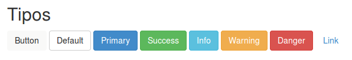

## Tipos (II)

~~~
<button type="button"
  class="btn">
  Button</button>

<button type="button"
  class="btn btn-default">
  Default</button>

<button type="button"
  class="btn btn-primary">
  Primary</button>

...
~~~

## Activados (I)

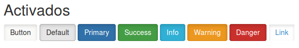

## Activados (II)

~~~
<button type="button"
  class="btn active">
  Button</button>

<button type="button"
  class="btn active btn-default">
  Default</button>

<button type="button"
  class="btn active btn-primary">
  Primary</button>

...
~~~

## Desactivados (I)

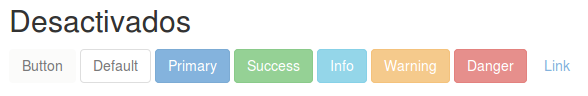

## Desactivados (II)

~~~
<button type="button"
  disabled="disabled"
  class="btn active">
  Button</button>

<button type="button"
  disabled="disabled"
  class="btn active btn-default">
  Default</button>

<button type="button"
  disabled="disabled"
  class="btn active btn-primary">
  Primary</button>

...
~~~

## Enlaces (I)

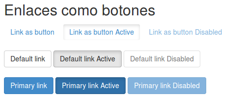

## Enlaces (II)

~~~
<a href="#"
  class="btn btn-primary"
  role="button">
  Primary link</a>

<a href="#"
  class="btn btn-primary active"
  role="button">
  Primary link Active</a>

<a href="#"
  class="btn btn-primary disabled"
  role="button">
  Primary link Disabled</a>
~~~

## Tamaños (I)

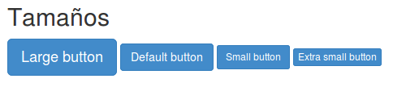

## Tamaños (II)

~~~
<button type="button"
  class="btn btn-primary btn-lg">
  Large button</button>

<button type="button"
  class="btn btn-primary">
  Default button</button>

<button type="button"
  class="btn btn-primary btn-sm">
  Small button</button>

<button type="button"
  class="btn btn-primary btn-xs">
  Extra small button</button>
~~~

## Expandir (I)

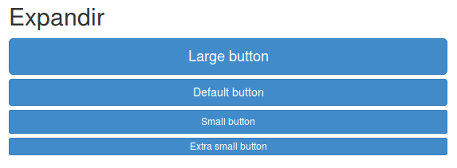

## Expandir (II)

~~~
<button type="button"
  class="btn btn-primary btn-lg
  btn-block">Large button</button>

<button type="button"
  class="btn btn-primary
  btn-block">Default button</button>

<button type="button"
  class="btn btn-primary btn-sm
  btn-block">Small button</button>

<button type="button"
  class="btn btn-primary btn-xs
  btn-block">Extra small</button>
~~~

# Imágenes

## Responsive

- Añadir **class=img-responsive** pondrá max-size=100% y height=auto.

## Efectos (I)

## Efectos (II)

- Se pueden añadir efectos:
    - **class=img-rounded**: redondea los bordes de la foto.
    - **class=img-circle**: convierte la foto en circular.
    - **class=img-thumbnail**: deja un pequeño recuadro a la foto.

# Helpers

## Textos coloreados (I)

## Textos coloreados (II)

~~~

  text-muted

  text-primary

  text-success

  text-info

  text-warning

  text-dangerx

~~~

## Colores de fondo (I)

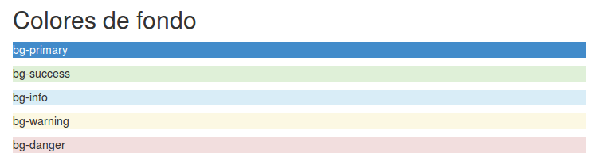

## Colores de fondo (II)

~~~

  bg-primary

  bg-success

  bg-info

  bg-warning

  bg-danger

~~~

## float y clearfix

~~~

  pull-left

  pull-right

antes del clearfix

después del clearfix

~~~

## Mostrar y ocultar

~~~

class=show > display: block

show

class=hidden > display: none

hidden

class=invisible > visibility: hidden (no desaparece del dom) 

invisible

class=text-hide
 útil cuando quieres una imagen de fondo

text-hide

~~~

## Accesibilidad

~~~

class=sr-only > solo aparece en los lectores de pantalla

class=sr-only-focusable > aparece cuando se hace foco sobre él

<a class="sr-only sr-only-focusable" href="#content">Skip to main content</a>
~~~

# Responsive

## Esconder según dispositivo

~~~

hidden-xs

hidden-sm

hidden-md

hidden-lg

~~~

## Mostrar como block según dispositivo

~~~

visible-block-xs

visible-block-sm

visible-block-md

visible-block-lg

~~~

## Mostrar como inline según dispositivo

~~~

visible-xs-inline

visible-sm-inline

visible-md-inline

visible-lg-inline

~~~

## Mostrar u ocultar para imprimir

~~~

hidden-print

visible-print-block

visible-print-inline

~~~

# Componentes

## Iconos (I)

- Utiliza una versión reducida de **glyphicons**:
    - <http://glyphicons.com>

- Alternativa **Font-Awesome**:
    - <http://fortawesome.github.io/Font-Awesome>

## Iconos (II)

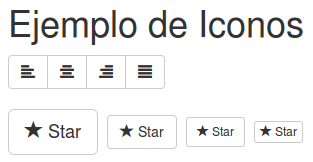

## Iconos (III)

~~~
<button type="button"
  class="btn btn-default">
   Star
</button>
~~~

## Dropdown (I)

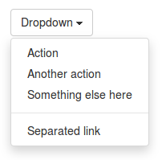

## Dropdown (II)

~~~

  <button ... data-toggle="dropdown">
    Dropdown</button>
  <ul ... class="dropdown-menu"
    role="menu">
    <li role="presentation"
      class="dropdown-header">
      Header</li>
    <li role="presentation"
      class="divider"></li>
    <li role="presentation">
      <a role="menuitem"... href="#">
      Action</a></li>
  </ul>

~~~

## Button groups (I)

## Button groups (II)

~~~

  <button type="button"
    class="btn
      btn-default">Left</button>

  <button type="button"
    class="btn
      btn-default">Middle</button>

  <button type="button"
    class="btn
      btn-default">Right</button>

~~~

## Input groups (I)

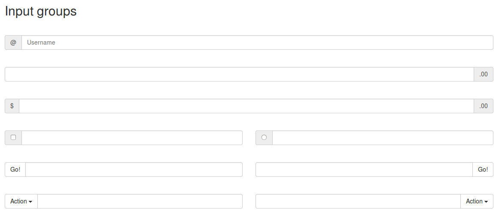

## Input groups (II)

~~~

  
   @
  <input type="text"
    class="form-control"
    placeholder="Username">

~~~

## Varios

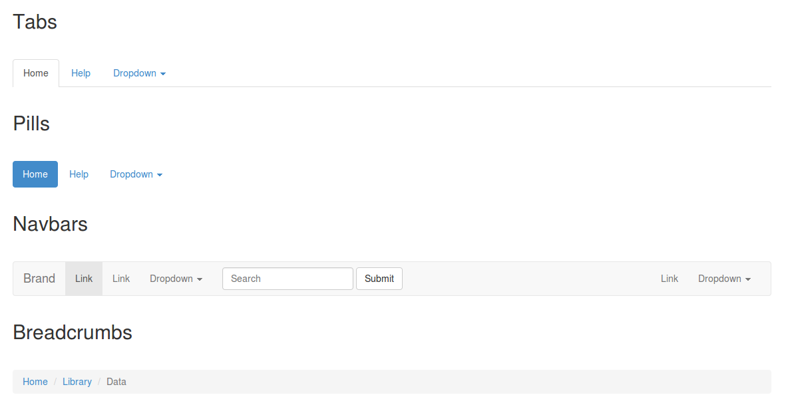

## Tabs

~~~
<ul class="nav nav-tabs"
  role="tablist">
  <li class="active">
    <a href="#">Home</a></li>
  <li><a href="#">Help</a></li>
  ...
</ul>
~~~

## Pills

~~~
<ul class="nav nav-pills">
  <li class="active">
    <a href="#">Home</a></li>
  <li><a href="#">Help</a></li>
  ...
</ul>
~~~

## Navbars

~~~
<nav ...>
  

    

      <button ... id="collapse-1">
        
        Toggle navigation
        ...
      </button>
      <a class="navbar-brand"
        href="#">Brand</a>

    

      <ul class="nav navbar-nav
        navbar-right">
        <li><a href="#">Link</a></li>
        ...
      </ul>

  

</nav>
~~~

## Breadcrumbs

~~~
<ol class="breadcrumb">
  <li><a href="#">Home</a></li>
  <li><a href="#">Library</a></li>
  <li class="active">Data</li>
</ol>
~~~

## Pagination (I)

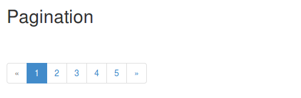

## Pagination (II)

~~~
<ul class="pagination">
  <li class="disabled">
    &laquo;</li>
  <li class="active">
    1 
      
      (current)
      </li>
  <li><a href="#">2</a></li>
  <li><a href="#">3</a></li>
  <li><a href="#">4</a></li>
  <li><a href="#">5</a></li>
  <li><a href="#">&raquo;</a></li>
</ul> 
~~~

## Pager (I)

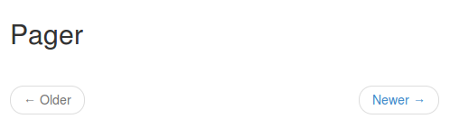

## Pager (II)

~~~
<ul class="pager">
  <li class="previous disabled">
    <a href="#">&larr; Older</a></li>
  <li class="next">
    <a href="#">Newer &rarr;</a></li>
</ul>
~~~

## Labels (I)

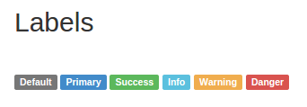

## Labels (II)

~~~
Default
Primary
Success
Info
Warning
Danger
~~~

## Badges (I)

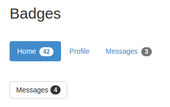

## Badges (II)

~~~
<ul class="nav nav-pills">
  <li class="active">
    <a href="#">Home
      
        42</a></li>
  <li><a href="#">Profile</a></li>
  <li><a href="#">Messages
    
      3</a></li>
</ul>
~~~

## Badges (III)

~~~
<button class="btn btn-default"
  type="button">Messages
  4
</button>
~~~

## Jumbotron (I)

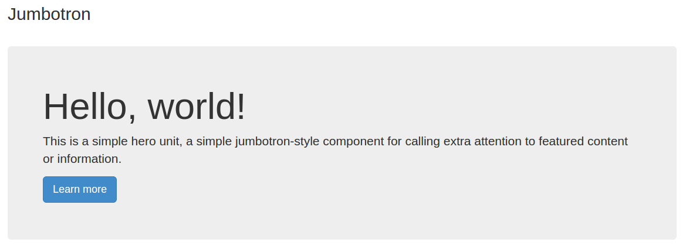

## Jumbotron (II)

~~~

  <h1>Hello, world!</h1>
  
...

  
<a 
    class="btn btn-primary btn-lg"
    role="button">
    Learn more</a>

~~~

## Thumbnails (I)

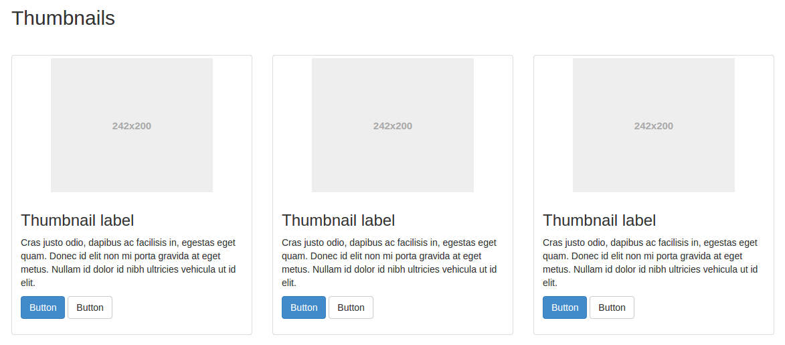

## Thumbnails (II)

~~~

  

    

      
      

        <h3>Thumbnail label</h3>
        
...

      

    

  

~~~

## Alerts (I)

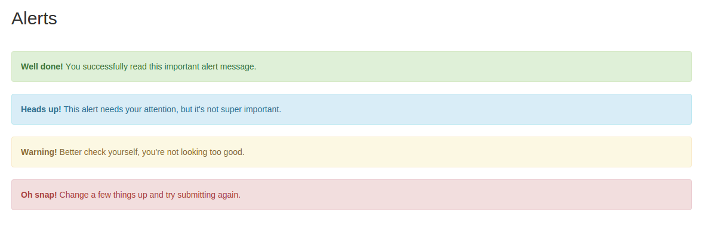

## Alerts (II)

~~~

  <strong>Well done!</strong>

  <strong>Heads up!</strong>

  <strong>Warning!</strong>

  <strong>Oh snap!</strong>

~~~

## Progress Bar (I)

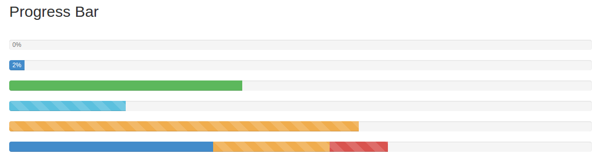

## Progress Bar (II)

~~~

  

    0%

  

    2%

~~~

## Progress Bar (III)

~~~

  

    
      40% Complete (success)...

  

    
      20% Complete...

  

    
    60% Complete (warning)...
~~~

## Progress Bar (IV)

~~~

  

    
    35% Complete (success)

  

    
    20% Complete (warning)

  

    
    10% Complete (danger)
  

~~~

## Media (I)

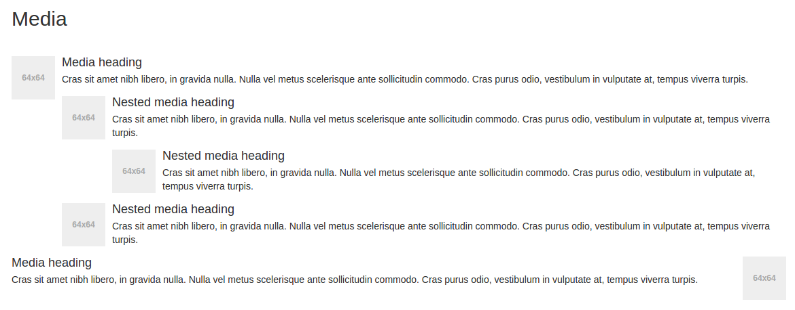

## Media (II)

~~~
<ul class="media-list">
  <li class="media">
    
    

      <h4 class="media-heading">
        Media heading</h4>
      
...

    

  </li>
</ul>
~~~

## List group (I)

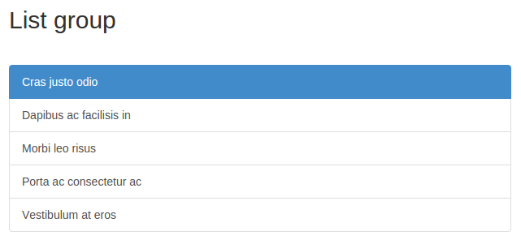

## List group (II)

~~~

  <a href="#"
    class="list-group-item active">
    Cras justo odio
  </a>
  <a href="#"
    class="list-group-item">
    Dapibus ac facilisis in</a>
    ...

~~~

## Panel group (I)

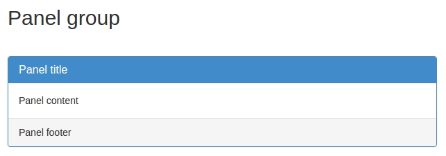

## Panel group (II)

~~~

  

    <h3 class="panel-title">
    Panel title</h3>

  

    Panel content

  

    Panel footer

~~~

## Responsive embed

~~~

  <iframe
    class="embed-responsive-item"
    src="//www.youtube.com/..."
    allowfullscreen=""></iframe>

~~~

# JavaScript

## Modal (I)

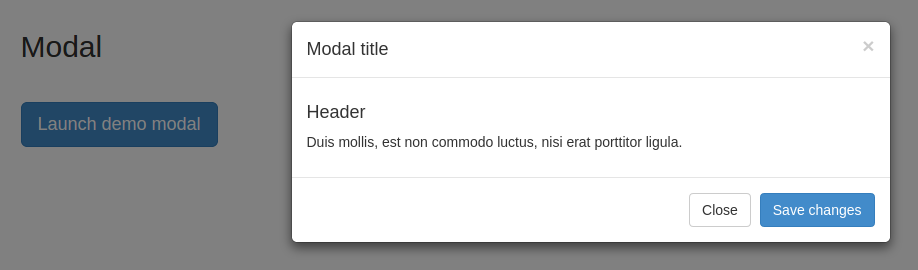

## Modal (II)

~~~
<button
  class="btn btn-primary btn-lg"
  data-toggle="modal"
  data-target="#myModal">
  Launch demo modal
</button>
~~~

## Modal (III)

~~~

  

    

      

        ...

      

        ...

      

        ...

    

  

~~~

## Tabs (I)

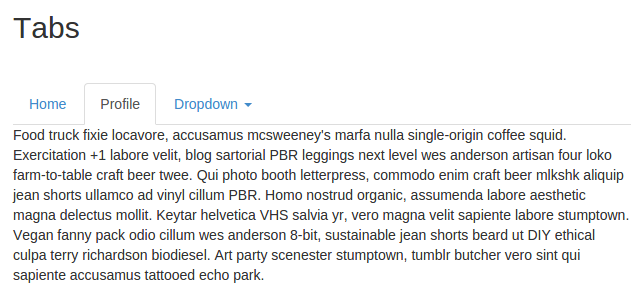

## Tabs (II)

~~~
<ul id="myTab" class="nav nav-tabs"
  role="tablist">
  <li class="">
    <a href="#home" role="tab"
      data-toggle="tab">
      Home</a></li>
  <li class="active">
    <a href="#profile" role="tab"
      data-toggle="tab">
      Profile</a></li>
  ...
</ul>
~~~

## Tabs (III)

~~~

  

    
...

  

  

    
...

  

  ...

~~~

## Tooltips (I)

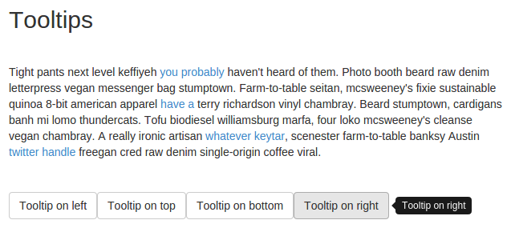

## Tooltips (II)

~~~

~~~

## Tooltips (III)

~~~

  Farm-to-table seitan, mcsweeney's
  fixie sustainable quinoa 8-bit
  american apparel
  <a href="#"
    data-toggle="tooltip"
    title="Another tooltip">
    have a</a>
  terry richardson vinyl chambray.

~~~

## Tooltips (IV)

~~~
<button type="button"
  class="btn btn-default"
  data-toggle="tooltip"
  data-placement="right"
  title="Tooltip on right">
    Tooltip on right</button>
~~~

## Popover (I)

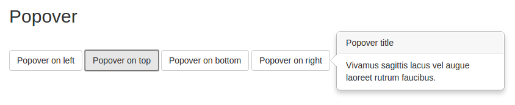

## Popover (II)

~~~

~~~

## Popover (III)

~~~
<button type="button"
  class="btn btn-default"
  title="Popover title"
  data-container="body"
  data-toggle="popover"
  data-placement="right"
  data-content="Vivamus
    sagittis lacus vel
    augue laoreet
    rutrum faucibus.">
      Popover on right
</button>
~~~

## Accordion (I)

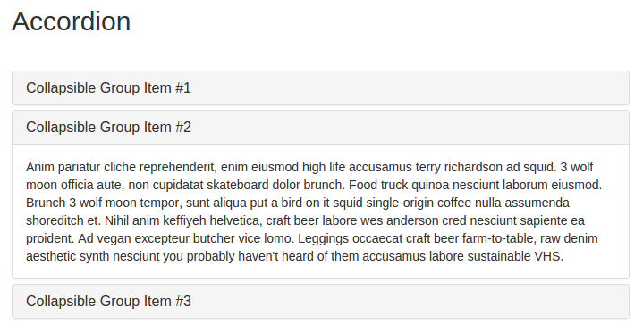

## Accordion (II)

~~~

  

    

      <h4 class="panel-title">
        <a data-toggle="collapse"
          data-parent="#accordion"
          href="#collapseOne">
            Group Item #1</a>
      </h4>

    

      

        ...

  

  ...

~~~

## Carousel (I)

## Carousel (II)

~~~

  

    <ol class="carousel-indicators">
      ...</ol>
    

      ...

    <a class="left carousel-control"
      ...</a>
    <a class="right carousel-control"
      ...</a>
  

~~~

## Carousel (III)

~~~
<ol class="carousel-indicators">
  <li data-target="
    #carousel-example-generic"
    data-slide-to="0" class=""></li>
  <li data-target="
    #carousel-example-generic"
    data-slide-to="1"
    class="active"></li>
  <li data-target="
    #carousel-example-generic"
    data-slide-to="2" class=""></li>
</ol>
~~~

## Carousel (IV)

~~~

  

    
  

  

    
  

  

    
  

~~~

## Carousel (V)

~~~
<a class="left carousel-control"
  href="#carousel-example-generic"
  role="button"
  data-slide="prev">
  
</a>
<a class="right carousel-control"
  href="#carousel-example-generic"
  role="button"
  data-slide="next">
  
</a>
~~~

# Ejemplos

## Índice

- Using the framework
- Navbars in action
- Custom components
- Experiments

### Using the framework

- Starter template
- Bootstrap theme
- Grids
- Jumbotron
- Narrow jumbotron

#### Starter template

- <http://getbootstrap.com/examples/starter-template>

#### Bootstrap theme

- <http://getbootstrap.com/examples/theme>

#### Grids

- <http://getbootstrap.com/examples/grid>

#### Jumbotron

- <http://getbootstrap.com/examples/jumbotron>

#### Narrow jumbotron

- <http://getbootstrap.com/examples/jumbotron-narrow>

### Navbars in action

- Navbar
- Static top navbar
- Fixed navbar

#### Navbar

- <http://getbootstrap.com/examples/navbar>

#### Static top navbar

- <http://getbootstrap.com/examples/navbar-static-top>

#### Fixed navbar

- <http://getbootstrap.com/examples/navbar-fixed-top>

### Custom components

- Cover
- Carousel
- Blog
- Dashboard
- Sign-in page
- Justified nav
- Sticky footer
- Sticky footer with navbar

#### Cover

- <http://getbootstrap.com/examples/cover>

#### Carousel

- <http://getbootstrap.com/examples/carousel>

#### Blog

- <http://getbootstrap.com/examples/blog>

#### Dashboard

- <http://getbootstrap.com/examples/dashboard>

#### Sign-in page

- <http://getbootstrap.com/examples/signin>

#### Justified nav

- <http://getbootstrap.com/examples/justified-nav>

#### Sticky footer

- <http://getbootstrap.com/examples/sticky-footer>

#### Sticky footer with navbar

- <http://getbootstrap.com/examples/sticky-footer-navbar>

### Experiments

- Non-responsive Bootstrap
- Offcanvas

#### Non-responsive Bootstrap

- <http://getbootstrap.com/examples/non-responsive>

#### Offcanvas

- <http://getbootstrap.com/examples/offcanvas>

# Personalización

## Tu propio CSS

- Una forma de personalizar tu página web hecha con bootstrap, es **añadiendo un fichero CSS, después de las llamadas a los CSS de bootstrap** (para que sobrescriba los valores)

- Esta es una **forma muy manual y muy poco productiva**.

## Página Customize

- Desde la página web de bootstrap <http://getbootstrap.com/customize> se pueden **personalizar un montón de variables, y descargar una versión personaliada** de bootstrap.

- Esta forma es más productiva, pero **sigue siendo bastante manual**, y además no puedes tener un control de cambios eficiente.

## Compilar Less

- La forma **más productiva y eficiente** de personalizar bootstrap es **compilando los ficheros Less del core a CSS**.

# Compilar Less

## Descarga

- Para ver **las tripas, y modificarlas (LESS)**, hay que descargar la versión completa:

    - <https://github.com/twbs/bootstrap/archive/v3.2.0.zip>

~~~
bootstrap/
├── less/
├── js/
├── fonts/
├── dist/
│   ├── css/
│   ├── js/
│   └── fonts/
└── docs/
    └── examples/
~~~

## Entorno

- Si queremos modificar el core (LESS), necesitamos:
    - intalar **NodeJS**,
    - luego **Grunt**
    - y para terminar instalar las **dependencias**.

## NodeJS

- NodeJS nos permite ejecutar **JavaScript del lado del servidor**.

- Para **instalar NodeJS**, hay que seguir las instrucciones de instalación de la página oficial para cada sistema operativo:
    - <http://nodejs.org>

## Grunt

- Grunt es un **automatizador de tareas** que se ejecuta sobre NodeJS.

- Una vez instalado NodeJS, **hay que instalar Grunt desde el gestor de paquetes de node (npm)** ejecutando  en un terminal, como administrador, el siguiente comando:

~~~
$ npm install -g grunt-cli
~~~

## Dependencias

- Una vez instalado NodeJS y Grunt, hay que **instalar las dependencias de bootstrap**.

- Para ello hay que situarse en la carpeta de bootstrap y ejecutar:

~~~
../bootstrap$npm install
~~~

## Default

- Si queremos lanzar **todas las tareas por defecto de grunt** (compilar, minificar, pasar los test, generar documentación...) tenemos que ejecutar lo siguiente

~~~
$ grunt
~~~

## Dist

- Si lo único que queremos es **compilar y minificar el CSS y el JavaScript**, tenemos que ejecutar lo siguiente:

~~~
$ grunt dist
~~~

## Watch

- También podemos **recompilar automaticamente los ficheros Less a CSS cuando salvas los cambios**, ejecutando el siguiente comando:

~~~
$ grunt watch
~~~

- El problema es que **sólo recompila ficheros Less a CSS, no los minifica**.

## Personalizar

- Uno de los ficheros que más se personaliza es **/bootstrap/less/variables.less**, pues en él están las variables más importantes que usa bootstrap.

# Acerca de

## Licencia

- Estas **transparencias** están hechas con:
    - MarkdownSlides: <https://github.com/asanzdiego/markdownslides>

- Estas **transparencias** están bajo una licencia Creative Commons Reconocimiento-CompartirIgual 3.0:
    - <http://creativecommons.org/licenses/by-sa/3.0/es>

## Fuentes

- Transparencias:
    - <https://github.com/asanzdiego/curso-interfaces-web-2014/tree/master/05-bootstrap/slides>

- Código:
    - <https://github.com/asanzdiego/curso-interfaces-web-2014/tree/master/05-bootstrap/src>

## Bibliografía

- Página oficial de Bootstrap:
    - <http://getbootstrap.com>

- Bootstrap sí, pero no
    - <http://bruno.garciaechegaray.com/Bootstrap.The.Melee/presentation>

- Ventajas y desventajas de usar Bootstrap
    - <http://jorgelessin.com/ventajas-y-desventajas-de-usar-bootstrap>
